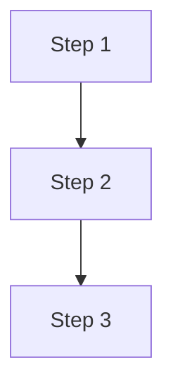

# Scrivener

Standalone Markdown-to-PDF converter built on ReportLab and mistune.

## Why Scrivener Exists

The WG21 paper pipeline originally ran through paperkiller - a Docker
microservice that chains Pandoc, Chromium, and mermaid-filter to
produce PDFs from markdown. Paperkiller works, but it requires a
multi-gigabyte Docker image containing Node.js, a headless browser,
and a Pandoc installation. Running it locally means pulling that
image. Running it in CI means paying for the image on every build.
The rendering path is indirect: markdown becomes HTML becomes a
browser page becomes a PDF. Every layer adds complexity and potential
for layout drift.

Scrivener replaces that pipeline with a single Python script.
`pip install -r requirements.txt` and run. No Docker, no Node, no
headless browser. ReportLab generates PDFs directly from an AST -
there is no intermediate HTML step, no browser rendering quirks, no
print-to-PDF margin negotiation. Variable fonts are instantiated
at arbitrary axis values. Styles are YAML files that cascade like
CSS. Fonts download on demand from URLs in a manifest file and
cache locally. Instantiated variable fonts are cached as static
TTFs so subsequent runs skip the expensive glyph computation.
The tool is a PDF compiler, not a service.

Scrivener is the local rendering path. Paperkiller remains available
as the server-side path for the web UI and REST API. Both produce
formatted PDFs from the same markdown sources. A comparison of
remaining feature gaps is in `gap-report.md`.

## Architecture

```
Markdown -> mistune v3 (AST) -> ASTRenderer (flowables) -> ReportLab -> PDF
```

- **Parser**: mistune v3 in AST mode with strikethrough and table
  plugins
- **Renderer**: converts AST tokens to ReportLab flowables (paragraphs,
  tables, code blocks, images, mermaid diagrams)
- **Style system**: flat YAML files in `styles/` with `inherits:`
  cascade and `@palette` color references
- **Fonts**: logical IDs in `fonts.yaml` manifest, variable font axis
  instantiation via fontTools, shared `.fonts/` download cache
- **Images**: shared `images/` directory for style assets (logos);
  document images resolve relative to the markdown file

## Installation

```
pip install -r requirements.txt
```

Python 3.10 or later. Fonts download automatically on first render.

## CLI Usage

```
python scrivener.py doc.md                    # -> .out/doc.pdf
python scrivener.py doc.md -o out.pdf         # explicit output path
python scrivener.py *.md                      # batch mode -> .out/
python scrivener.py doc.md --style wg21       # named style
python scrivener.py doc.md --toc              # force TOC on
python scrivener.py doc.md --no-toc           # force TOC off
python scrivener.py doc.md --logo logo.svg    # override logo
python scrivener.py doc.md --options '{"toc": true}'
python scrivener.py --list-styles             # JSON style catalog
```

| Argument | Description |
|----------|-------------|
| `input` | One or more markdown files or glob patterns |
| `-o`, `--output` | Output PDF path (single-file mode only) |
| `--outdir` | Output directory for batch mode (default: `.out/`) |
| `--style` | Style name from `styles/` or path to a YAML file |
| `--logo` | Override logo image path |
| `--toc` | Force table of contents on |
| `--no-toc` | Force table of contents off |
| `--options` | JSON string or path to JSON file with option overrides |
| `--list-styles` | Print JSON style catalog and exit |

Output defaults to `.out/<filename>.pdf` when no `-o` or `--outdir`
is given.

## Styles

Styles are flat YAML files in the `styles/` directory:

```
styles/
  default.yaml      # base style - typography, colors, layout
  wg21.yaml         # inherits default, adds WG21 front matter fields
```

### Inheritance

A derived style declares `inherits:` and only specifies what it
overrides. Everything else comes from the base:

```yaml
inherits: default
name: "My Style"
accent_saturated: "#1a5276"
headings:
  h1: { scale: 1.80 }     # other h1 properties inherited
fonts:
  body:
    axes: { wdth: 87.5 }  # font ID inherited, only axes change
```

**Merge rule**: dicts merge recursively. Scalars and lists replace
the base value. Circular inheritance is detected and rejected.

### Palette References

The `palette:` section defines named colors. Any string value
starting with `@` resolves to the matching palette entry:

```yaml
palette:
  brand: "#A91C21"
accent_saturated: "@brand"   # resolves to "#A91C21"
```

Palette resolution runs after inheritance merge, so a derived style
can override palette entries and all references update.

### Options

The `options:` list defines which keys can be set via `--options`
on the CLI. Each entry has `id`, `label`, `type`, and `default`:

```yaml
options:
  - id: toc
    label: "Table of Contents"
    type: bool
    default: false
```

`--options '{"toc": true}'` sets `style["toc"] = true`. Unknown
keys are rejected.

## Style YAML Reference

Every key available in a style file, grouped by section. All keys
are optional in derived styles - only the base style needs the
full set.

### Identity

| Key | Type | Description |
|-----|------|-------------|
| `name` | string | Display name in `--list-styles` catalog |
| `description` | string | Short description in catalog |
| `inherits` | string | Base style name (filename stem in `styles/`) |

### Page

| Key | Type | Default | Description |
|-----|------|---------|-------------|
| `page_size` | string | `a4` | Paper size. Values: `letter`, `legal`, `a3`, `a4`, `a5`, `a6`, `b4`, `b5`, `half-letter`, `junior-legal`, `tabloid`, `ledger`, `gov-letter`, `gov-legal` |

### Palette

Named color definitions. Any string value elsewhere in the style
can reference these with `@name`.

| Key | Default | Description |
|-----|---------|-------------|
| `brand` | `#A91C21` | Primary brand color |
| `text` | `#2c2c2c` | Body text color |
| `text-mid` | `#4a4a4a` | Medium-emphasis text |
| `text-muted` | `#6b6b6b` | Low-emphasis text |
| `text-faint` | `#888888` | Faint text (page numbers) |
| `bg-subtle` | `#f7f7f7` | Subtle background (code, front matter) |
| `bg-light` | `#e0e0e0` | Light background (table headers) |
| `rule` | `#e0ddd8` | Rule/border color |
| `code-fg` | `#333333` | Code block text color |
| `code-red` | `#aa3344` | Inline code text color |

### Colors

Semantic color assignments. Values can be hex colors, `@palette`
references, or special values (`auto`, `from_logo`).

| Key | Default | Description |
|-----|---------|-------------|
| `accent_saturated` | `@brand` | Primary accent. Supports `from_logo` to extract from logo image |
| `accent_mid` | `auto` | Mid-tone accent. `auto` derives from `accent_saturated` via HSL |
| `link_color` | `@brand` | Hyperlink color |
| `code_fg` | `@code-fg` | Fenced code block text color |
| `code_inline_fg` | `@code-red` | Inline code text color |
| `code_bg` | `@bg-subtle` | Fenced code block background |
| `code_inline_bg` | `@bg-subtle` | Inline code background |
| `blockquote_fg` | `@text-mid` | Blockquote text color |
| `blockquote_bg` | `@bg-subtle` | Blockquote background |
| `heading_rule_color` | `@rule` | Horizontal rule under headings |
| `table_header_bg` | `@bg-light` | Table header row background |
| `table_header_fg` | `@text` | Table header text color |
| `table_header_weight` | `537` | Table header font weight (variable font axis) |
| `table_rule_color` | `@rule` | Table row separator color |
| `table_stripe_bg` | `@bg-subtle` | Alternating table row background |
| `page_number_color` | `@text-muted` | Page number color |
| `front_matter_label_color` | `@text-muted` | Front matter label color |

### Fonts

Each slot maps a typographic role to a font from the manifest.
The `font` value is a logical ID from `fonts.yaml`. The `axes`
dict specifies variable font axis values.

| Slot | Default Font | Default Axes | Description |
|------|-------------|--------------|-------------|
| `body` | `noto-sans` | `wdth: 75, wght: 400` | Body text |
| `body_bold` | `noto-sans` | `wdth: 75, wght: 537` | Bold body text |
| `body_italic` | `noto-serif-italic` | `wdth: 75, wght: 400` | Italic body text |
| `body_bold_italic` | `noto-serif-italic` | `wdth: 75, wght: 537` | Bold italic body text |
| `code` | `noto-sans-mono` | `wdth: 62.5, wght: 400` | Code blocks and inline code |
| `code_bold` | `noto-sans-mono` | `wdth: 62.5, wght: 600` | Bold code |
| `code_italic` | `noto-sans-mono` | `wdth: 62.5, wght: 400` | Italic code |
| `code_bold_italic` | `noto-sans-mono` | `wdth: 62.5, wght: 600` | Bold italic code |
| `cjk` | `noto-sans-cjk` | `wght: 400` | CJK fallback for characters outside the body font |

### Typography

| Key | Type | Default | Description |
|-----|------|---------|-------------|
| `body_size` | number | `10` | Base font size in points. All proportional spacing derives from this |
| `line_height` | number | `1.85` | Line height multiplier applied to `body_size` |

### Headings

Per-level heading configuration. Each level (`h1` through `h6`)
accepts the same keys:

| Key | Type | Default | Description |
|-----|------|---------|-------------|
| `scale` | number | varies | Font size as multiplier of `body_size` (h1: 1.60, h2: 1.30, h3: 1.15, h4: 1.05, h5-h6: 1.00) |
| `leading_scale` | number | `1.3` | Line height as multiplier of `body_size` |
| `space_before` | number | `1.5` | Space above heading as multiplier of heading font size |
| `space_after` | number | `1.0` | Space below heading as multiplier of heading font size |
| `rule` | bool | unset | If true, draw a horizontal rule below the heading |

### Code Blocks

| Key | Type | Default | Description |
|-----|------|---------|-------------|
| `code_block.font_scale` | number | `0.82` | Code font size as multiplier of `body_size` |
| `code_block.leading_scale` | number | `1.55` | Code line height as multiplier of `body_size` |
| `code_block.bar_width` | number | `3` | Left accent bar width in points |
| `code_block.left_padding` | number | `15` | Left padding inside code box |
| `code_block.right_padding` | number | `15` | Right padding inside code box |
| `code_block.vertical_padding` | number | `15` | Top and bottom padding inside code box |

### Blockquotes

| Key | Type | Default | Description |
|-----|------|---------|-------------|
| `blockquote.bar_width` | number | `3` | Left accent bar width in points |
| `blockquote.left_padding` | number | `15` | Left padding inside blockquote box |
| `blockquote.right_padding` | number | `15` | Right padding |
| `blockquote.vertical_padding` | number | `10` | Top and bottom padding |
| `blockquote.corner_radius` | number | `4` | Rounded corner radius |

**Blockquote variants** - used with `[!NOTE]`, `[!WARNING]`,
`[!CAUTION]` callouts:

| Key | Default | Description |
|-----|---------|-------------|
| `blockquote.variants.note.bar_color` | `#0277aa` | Note accent bar color |
| `blockquote.variants.note.bg` | `#eef6fa` | Note background color |
| `blockquote.variants.warning.bar_color` | `#dd8800` | Warning accent bar color |
| `blockquote.variants.warning.bg` | `#fef8ee` | Warning background |
| `blockquote.variants.caution.bar_color` | `#A91C21` | Caution accent bar color |
| `blockquote.variants.caution.bg` | `#fdf2f2` | Caution background |

### Lists

| Key | Type | Default | Description |
|-----|------|---------|-------------|
| `list.left_indent` | number | `20` | Indent per nesting level in points |
| `list.bullet_dedent` | number | `14` | Bullet character offset from indent |
| `list.space_before` | number | `4` | Space above list items |
| `list.space_after` | number | `4` | Space below list items |
| `list.bullets` | list | `["\u2022", "\u2013", "\u00B7"]` | Bullet characters per nesting depth |

### Tables

| Key | Type | Default | Description |
|-----|------|---------|-------------|
| `table.font_scale` | number | `0.92` | Table font size as multiplier of `body_size` |
| `table.smart_columns` | bool | `true` | Auto-size column widths based on content |
| `table.cell_padding.top` | number | `5` | Cell top padding |
| `table.cell_padding.bottom` | number | `5` | Cell bottom padding |
| `table.cell_padding.left` | number | `10` | Cell left padding |
| `table.cell_padding.right` | number | `10` | Cell right padding |
| `table.header_rule_width` | number | `0` | Rule width below header row (0 = none) |
| `table.body_rule_width` | number | `1` | Rule width between body rows |

### Title Block

| Key | Type | Default | Description |
|-----|------|---------|-------------|
| `title.rule_thickness` | number | `3` | Thickness of rule below title |
| `title.logo_height` | number | `36` | Logo height in points |
| `title.logo_column_width` | number | `55` | Width reserved for logo column |

### Logo and TOC

| Key | Type | Default | Description |
|-----|------|---------|-------------|
| `logo` | string | `"C++ Alliance - Logo.svg"` | Logo filename (resolved from `images/` directory) |
| `toc` | bool/string | `auto` | Table of contents: `true`, `false`, or `auto` (appears when front matter fields produce content) |
| `toc_indent` | number | `18` | Indent step per TOC heading level |

### Syntax Highlighting

Pygments token colors. Applied to fenced code blocks when a
language is specified.

| Key | Default | Description |
|-----|---------|-------------|
| `syntax.keyword` | `#622876` | Language keywords |
| `syntax.type` | `#005f88` | Type names |
| `syntax.function` | `#1b5196` | Function names |
| `syntax.string` | `#366d36` | String literals |
| `syntax.number` | `#8f4700` | Numeric literals |
| `syntax.comment` | `#6e6e6e` | Comments |
| `syntax.preprocessor` | `#882936` | Preprocessor directives |
| `syntax.operator` | `#444444` | Operators |

### Wording Divs

Styling for WG21 proposed wording sections. Used with `:::wording`,
`:::wording-add`, and `:::wording-remove` fenced divs.

| Key | Type | Default | Description |
|-----|------|---------|-------------|
| `wording.bar_width` | number | `3` | Left accent bar width |
| `wording.padding` | number | `15` | Inner padding |
| `wording.radius` | number | `4` | Corner radius |
| `wording.ins_color` | color | `#006e28` | `<ins>` text color (green) |
| `wording.del_color` | color | `#bf0303` | `<del>` text color (red) |

**Wording div variants**:

| Key | `bg` | `bar_color` | Description |
|-----|------|-------------|-------------|
| `wording.wording` | `#f7f7f7` | `#6b6b6b` | Unchanged spec text (neutral) |
| `wording.wording-add` | `#eef6ee` | `#66aa66` | Added text (green) |
| `wording.wording-remove` | `#fdf2f2` | `#A91C21` | Removed text (red) |

### Front Matter

Visual settings for the metadata table rendered from YAML front
matter. The `fields` list is typically provided by a derived style
(e.g., `wg21.yaml`).

| Key | Type | Default | Description |
|-----|------|---------|-------------|
| `front_matter.font_scale` | number | `0.9` | Font size multiplier for values |
| `front_matter.leading_scale` | number | `1.65` | Line height multiplier |
| `front_matter.bg` | color | `@bg-subtle` | Background color |
| `front_matter.bar_width` | number | `3` | Left accent bar width |
| `front_matter.inner_pad` | number | `12` | Inner padding |
| `front_matter.label_col` | number | `130` | Label column width in points |
| `front_matter.cell_v_pad` | number | `3` | Vertical padding per cell |
| `front_matter.space_after` | number | `0` | Space below the front matter box |
| `front_matter.fields` | list | (none) | List of `{ field, label }` entries defining which YAML keys to render |

**Fields example** (from `wg21.yaml`):

```yaml
front_matter:
  fields:
    - { field: document, label: "Document Number" }
    - { field: date, label: Date }
    - { field: audience, label: Audience }
    - { field: reply-to, label: "Reply-to" }
```

## Font Manifest

The `fonts.yaml` file maps logical font IDs to filenames and
download URLs. Styles reference fonts by ID, not by filename.

| ID | File | Description |
|----|------|-------------|
| `noto-sans` | `NotoSans[wdth,wght].ttf` | Body text (variable width and weight) |
| `noto-serif-italic` | `NotoSerif-Italic[wdth,wght].ttf` | Italic body text |
| `noto-sans-cjk` | `NotoSansCJKsc-VF.ttf` | CJK fallback |
| `noto-sans-mono` | `NotoSansMono[wdth,wght].ttf` | Monospace for code |

To add a font, add an entry to `fonts.yaml` with `id`, `file`,
and `url`, then reference the ID in a style's `fonts:` section.
The font downloads automatically on first use into the shared
`.fonts/` cache (gitignored). Instantiated variable fonts (with
axes pinned to specific values) are cached as static TTFs in
`.fonts/cache/`. The cache is invalidated when the source font
file is newer than the cached file.

## Images

Style assets (logos) live in the `images/` directory at the
scrivener root. This directory is committed to the repo.

Logo resolution order:
1. `images/<logo value>`
2. Markdown file's directory

The `--list-styles` JSON output includes an `images` array listing
all files in this directory so callers can present available choices.

## Document Features

### Front Matter

Documents can begin with a YAML front matter block:

```yaml
---
title: "Paper Title"
document: D0000R0
date: 2026-04-20
audience: SG1, LEWG
reply-to:
  - "Author Name <author@example.com>"
---
```

Which fields are rendered depends on the style's
`front_matter.fields` list. The `title` key controls the title
block. Email addresses in angle brackets become mailto links.

These front matter keys can override style settings:
`logo`, `toc`, `accent_saturated`, `accent_mid`.

### Title Block

If the front matter has a `title` key, that becomes the document
title. If there is no front matter title, the first `#` heading
is used as the title block (with logo and rule). Subsequent `#`
headings render as normal H1.

### Table of Contents

- `toc: auto` (default) - TOC appears when front matter fields
  produce content
- `toc: true` or `--toc` - always show TOC
- `toc: false` or `--no-toc` - never show TOC

### Wording Divs

For WG21 proposed wording sections. Three variants:

```markdown
:::wording

Unchanged spec text with <ins>additions</ins> and
<del>deletions</del> inline.

:::
```

```markdown
:::wording-add

Purely new text (green box).

:::
```

```markdown
:::wording-remove

Purely removed text (red box).

:::
```

### Blockquote Callouts

GitHub-style callouts on the first line of a blockquote:

```markdown
> [!NOTE]
> This is a note with blue accent.

> [!WARNING]
> This is a warning with orange accent.

> [!CAUTION]
> This is a caution with red accent.
```

### Mermaid Diagrams

Fenced `mermaid` code blocks render as inline SVG diagrams:

````markdown

````

**Known limitations** - the pure-Python `merm` renderer does not
support all Mermaid syntax:
- Use explicit edge pairs (`A --> B`, `B --> C`) not chained
  continuation arrows
- Do not use named task IDs in Gantt charts (`:milestone, name,
  date` - drop the name)

### Page Breaks

A paragraph containing only `\newpage` inserts a page break:

```markdown
\newpage
```

### Syntax Highlighting

Fenced code blocks with a language tag are highlighted via Pygments.
Colors come from the `syntax` section of the style. When no language
is specified, Pygments guesses the lexer from the content. If
Pygments is not installed or the language is unknown, code renders
as plain text.

### Superscript and Subscript

Inline HTML `<sup>` and `<sub>` tags are converted to ReportLab
superscript and subscript. Both paired tags and split open/close
fragments are supported.

### Inline Markup in Wording Divs

Inside `:::wording` blocks, `<ins>` renders as underlined green
text and `<del>` renders as struck-through red text. Colors come
from `wording.ins_color` and `wording.del_color`.

### Nested Blockquotes

Blockquotes can nest. Each level shrinks the inner width by the
blockquote's `left_padding` value.

### Nested Lists

Ordered and unordered lists nest to arbitrary depth. Bullet
characters cycle through the `list.bullets` array per depth level
(default: bullet, en-dash, middle dot).

### Block Images

Images referenced with `` are resolved relative to the
markdown file's directory. Images wider than the content area are
scaled down proportionally. Missing images render as
`[image: path]` placeholder text.

### Table Zebra Striping

Alternating table body rows receive the `table_stripe_bg`
background color for readability. Header rows use
`table_header_bg`.

### Smart Table Column Widths

When `table.smart_columns` is `true` (default), column widths are
calculated from content. Columns with short text get less space;
columns with long text get more. This avoids equal-width columns
wasting space on narrow data. Set to `false` for equal-width
columns.

### Table Header Repeat

When a table spans multiple pages, the header row automatically
repeats at the top of each continuation page.

### Heading Widow/Orphan Control

Headings are prevented from being stranded at the bottom of a page
with their content on the next page. The heading, its optional rule,
and any following spacer are chained together via `keepWithNext` so
the group moves to the next page as a unit when there is not enough
room for the heading plus at least the first content element below
it.

### Inline Code Styling

Inline code spans render with rounded background rectangles
and horizontal padding. This is implemented via a
ReportLab paragraph patch that draws rounded rects behind
`backColor` spans.

### Variable Font Instantiation

Fonts are instantiated at exact axis values specified in the style.
A single variable font file can produce different weights and widths
without shipping separate font files. The `axes` dict in each font
slot controls the instantiation. Instantiated fonts are cached as
static TTFs in `.fonts/cache/` so the expensive fontTools
computation runs only once per font per axis configuration.
Subsequent renders load the cached static font directly:

```yaml
fonts:
  body:
    font: noto-sans
    axes: { wdth: 75, wght: 400 }    # condensed, regular weight
  body_bold:
    font: noto-sans
    axes: { wdth: 75, wght: 537 }    # condensed, semi-bold
```

### Accent Color from Logo

Setting `accent_saturated: from_logo` extracts the dominant
chromatic color from the logo image and uses it as the primary
accent. The `accent_mid` value can be set to `auto` to derive a
lighter mid-tone from the saturated accent via HSL adjustment.

### PDF Metadata

The generated PDF carries metadata from the front matter:
`title` becomes the PDF title, `reply-to` becomes the PDF author.
These appear in PDF reader title bars and document properties.

### Page Numbers

Every page has a centered page number at the bottom, rendered in
the body font at 8pt in `page_number_color`.

### Title Auto-Shrink

If the document title is wider than the available space (accounting
for the logo column), the title font size scales down
proportionally to fit on one line.

### Unsupported Token Visibility

Markdown elements that scrivener does not handle render as visible
`[unsupported: type]` paragraphs rather than being silently dropped.
This makes missing features immediately obvious in the output.

### CJK Support

Characters outside the body font's coverage automatically fall
back to the CJK font. Detection is per-character using the body
font's cmap table. No configuration needed.

## Config Precedence

Values resolve in this order (last wins):

1. Base style YAML
2. `inherits:` merge (deep merge, child overrides base)
3. Palette `@reference` resolution
4. Front matter overrides (`logo`, `toc`, `accent_saturated`,
   `accent_mid` only)
5. CLI overrides (`--logo`, `--toc`, `--no-toc`, `--options`)

## File Map

| File | Description |
|------|-------------|
| `scrivener.py` | CLI entry point. Argparse, batch processing, main loop |
| `lib/__init__.py` | Package marker. `escape_xml()` utility |
| `lib/builder.py` | `build_pdf()` orchestration. Wires config, fonts, renderer, and ReportLab document |
| `lib/config.py` | Style loading with `inherits:` cascade, `deep_merge()`, font manifest, `resolve_font_files()`, option handling, front matter extraction, config merge, `sp()`, `load_logo`, `list_images()` |
| `lib/renderer.py` | `ASTRenderer`. AST-to-flowable conversion. The largest module |
| `lib/flowables.py` | `AccentBox`, `AccentRule`, `PageChrome`. Drawing primitives |
| `lib/fonts.py` | Font cache (in-memory + disk), variable-font instantiation, ReportLab registration |
| `lib/colors.py` | Color math. `hex_to_hsl`, `resolve_accent`, `derive_mid`, `resolve_colors` |
| `lib/highlight.py` | Syntax highlighting via Pygments |
| `lib/inline_patch.py` | Rounded background rectangles for inline code |
| `fonts.yaml` | Font manifest (logical IDs to files and URLs) |
| `styles/*.yaml` | Style definitions |
| `images/` | Shared image assets (logos) |
| `.fonts/` | Download cache for variable fonts (gitignored). `.fonts/cache/` holds instantiated static TTFs |
| `.out/` | Default PDF output directory (gitignored) |
| `gap-report.md` | Feature comparison with paperkiller |

## Known Limitations

- **Mermaid**: the `merm` pure-Python parser has limited syntax
  support. Chained arrows and named task IDs require workarounds
- **Footnotes**: not supported (mistune has no footnote plugin)
- **Definition lists**: not supported
- **Math/LaTeX**: not supported
- **Inline images**: alt text only (block images work)
- **Raw HTML**: escaped as text, not rendered
- **PDF bookmarks**: not generated from headings

See `gap-report.md` for the full comparison with paperkiller.

## Future: Event Bus

Scrivener has no global state or event system. Callers like
Paperworks currently poll or reload after renders to detect
side effects (e.g. fonts downloaded on first use).

The planned fix: a module-level event bus (`lib/events.py`)
with `on(callback)`, `emit(event, **data)`, and `clear()`.
Any Scrivener function can emit events (fonts_downloaded,
render_start, render_complete) without knowing who is
listening. Callers register a handler once at startup.
No function signature changes needed.
