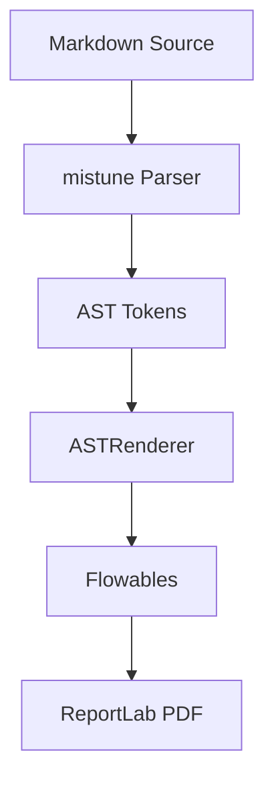
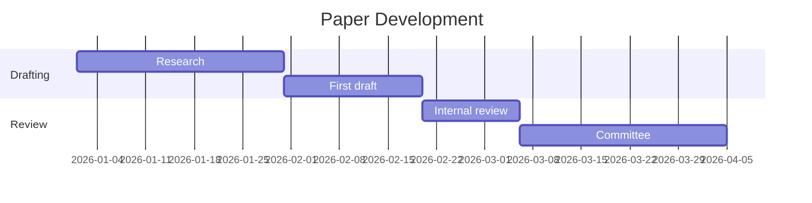

## Abstract

This document exercises every markdown construct that scrivener must handle. It exists solely for visual regression testing.

---

## Revision History

### R0: April 2026

* Initial version.

## 1. Inline Formatting

This paragraph has *italic text* and **bold text** and ***bold italic text*** all in one line. It also has `inline code` and ~~strikethrough~~ if supported.

Here is a [hyperlink to cppreference](https://en.cppreference.com/) and an auto-link: <https://wg21.link/p2300>.

Superscript: E = mc<sup>2</sup> and footnote references<sup>[1]</sup>.

Subscript: H<sub>2</sub>O is water and CO<sub>2</sub> is carbon dioxide.

Hard line break: This line ends with a break.<br>This continues on a new line.

---

## 2. Headings

# Heading Level 1

## Heading Level 2

### Heading Level 3

#### Heading Level 4

##### Heading Level 5

###### Heading Level 6

---

## 3. Block Quotes

> This is a simple block quote. It should render with a left accent bar and slightly indented text.

> This is a multi-paragraph block quote.
>
> It has a second paragraph. The visual treatment should be consistent across both paragraphs.
>
> And a third, for good measure.

> Nested quotes:
>
> > This is a nested block quote inside an outer one.
> > It should be visually distinct.

---

## 4. Lists

### Unordered Lists

* First item
* Second item
* Third item with *italic* and **bold** words
* Fourth item with `inline code`

Nested unordered:

* Top level
  * Nested once
    * Nested twice
  * Back to nested once
* Back to top

### Ordered Lists

1. First item
2. Second item
3. Third item with a [link](https://example.com)
4. Fourth item

Nested ordered:

1. Top level
   1. Nested once
   2. Still nested
2. Back to top
   1. Another nested
      1. Deeply nested

### Mixed Lists

1. Ordered first
   * Unordered child
   * Another child
2. Ordered second
   * Child with *emphasis*

---

## 5. Code Blocks

Inline code was shown above. Here is a fenced code block:

```cpp
#include <iostream>
#include <vector>
#include <algorithm>

template<typename T>
concept Sortable = requires(T& t) {
    std::sort(t.begin(), t.end());
};

int main() {
    std::vector<int> v = {3, 1, 4, 1, 5, 9, 2, 6};
    std::sort(v.begin(), v.end());
    for (auto x : v)
        std::cout << x << ' ';
    std::cout << '\n';
}
```

A Python example:

```python
def fibonacci(n: int) -> list[int]:
    """Generate first n Fibonacci numbers."""
    if n <= 0:
        return []
    fib = [0, 1]
    while len(fib) < n:
        fib.append(fib[-1] + fib[-2])
    return fib[:n]

print(fibonacci(10))
```

A plain (no language) code block:

```
This is a plain code block.
No syntax highlighting.
Just monospaced text.
```

---

## 6. Horizontal Rules

Above and below this section are horizontal rules produced by `---`.

---

## 7. Tables

| Principle | Verdict | Confidence |
|-----------|---------|------------|
| Zero-overhead | Pass | High |
| Type safety | Fail | Medium |
| Value semantics | Pass | High |
| RAII | N/A | Low |
| Multi-paradigm | Pass | High |

A table with alignment:

| Left-aligned | Center-aligned | Right-aligned |
|:-------------|:--------------:|--------------:|
| Cell 1 | Cell 2 | Cell 3 |
| Longer content here | Short | 42 |
| *Italic* | **Bold** | `Code` |

---

## 8. Images


---

## 9. International Characters

German: Die Gr&ouml;&szlig;e des &Uuml;bersetzers ist beeindruckend.

French: Les caract&egrave;res sp&eacute;ciaux sont n&eacute;cessaires.

Chinese: 这是中文测试文本。

Japanese: これはテストです。

Korean: 이것은 테스트입니다.

---

## 10. Long Paragraph

Lorem ipsum dolor sit amet, consectetur adipiscing elit. Sed do eiusmod tempor incididunt ut labore et dolore magna aliqua. Ut enim ad minim veniam, quis nostrud exercitation ullamco laboris nisi ut aliquip ex ea commodo consequat. Duis aute irure dolor in reprehenderit in voluptate velit esse cillum dolore eu fugiat nulla pariatur. Excepteur sint occaecat cupidatat non proident, sunt in culpa qui officia deserunt mollit anim id est laborum. This paragraph is intentionally long to test line wrapping, paragraph spacing, and general text flow across multiple lines in the PDF output.

---

## 11. Nested Block Quotes with Code

> Here is a block quote that contains code:
>
> ```cpp
> auto x = co_await async_read(socket, buffer);
> ```
>
> The code above shows a coroutine-based read.

---

## 12. Complex List Items

1. **First principle** - Zero-overhead abstraction means you do not pay for what you do not use.

   This list item has a continuation paragraph.

2. **Second principle** - Type safety prevents undefined behavior at compile time.

   > And this list item contains a block quote.

3. **Third principle** - Value semantics simplify reasoning about program state.

---

## 13. Multiple Inline Styles

This sentence has *italic*, **bold**, ***bold italic***, `code`, and a [link](https://example.com) all together. Here is **bold with `code` inside** and *italic with `code` inside* and **bold with *italic* inside**.

---

## 14. Definition-style Content

The following uses bold terms with descriptions, a common pattern in WG21 papers:

* **Allocator-aware** - A type that accepts and propagates an allocator argument.
* **Trivially relocatable** - A type whose move-construction followed by destruction of the source is equivalent to `memcpy`.
* **Structural type** - A type usable as a non-type template parameter.

---

## 15. Empty Sections and Edge Cases

This section is followed by another with no body text.

## 16. Minimal Section

## 17. Blockquote Variants

> [!NOTE]
> This is a note. Notes provide additional context or clarification that may be helpful but is not critical to understanding the proposal.

> [!WARNING]
> This is a warning. Warnings highlight potential issues or pitfalls that require careful attention during review.

> [!CAUTION]
> This is a caution. Cautions indicate something that could cause problems or break existing code if not handled properly.

---

## 18. Wording Divs

Proposed wording changes use fenced divs with `:::wording` syntax.

:::wording

This is existing spec text rendered in a neutral wording block. It represents unchanged normative or descriptive content from the standard.

:::

:::wording-add

This is new text being proposed for addition to the standard. The green accent bar indicates additive content.

The function `connect` shall establish a connection to the endpoint. If the connection succeeds, the implementation returns `true`.

:::

:::wording-remove

This is text being proposed for removal from the standard. The red accent bar indicates content to be deleted.

The function `disconnect` shall close the connection. The implementation calls `cleanup()` before returning.

:::

:::wording

<ins>*Mandates:* The expression has type `std::coroutine_handle<>`.</ins>

:::

:::wording

The function returns <del>void</del><ins>bool</ins>. For each element <del>e</del><ins>x</ins> in the range, the implementation calls <del>f(e)</del><ins>invoke(f, x)</ins>.

:::

---

## 19. Mermaid Diagrams





## 21. Page Break

The next line forces a page break.

\newpage

This text appears on a new page after the forced break.

## 22. Code Blocks Inside Wording

:::wording

Existing code in the standard:

```cpp
void start(operation_state auto& op) noexcept;
```

:::

:::wording-add

New code being added:

```cpp
coroutine_handle<> start(operation_state auto& op) noexcept;
```

:::

:::wording-remove

Code being removed:

```cpp
void notify_complete(receiver auto& rcvr) noexcept;
```

:::

## 23. Pre/Code HTML Blocks

A `<pre><code>` block outside wording:

<pre><code>auto result = compute(x, y);
return result;</code></pre>

A `<pre><code>` block inside wording with insertions and deletions:

:::wording

<pre><code><del>void</del><ins>coroutine_handle&lt;&gt;</ins> await_suspend(
    coroutine_handle&lt;Promise&gt;) noexcept
{
    <del>start(state);</del>
    <ins>auto h = start(state);</ins>
    <ins>return h ? h : noop_coroutine();</ins>
}</code></pre>

:::

## 24. Heading with Inline `code`

### Subsection using `std::optional<T>`

This exercises the Code-Bold rendering inside headings at heading-scaled size.

---

## 25. Codespan Inside `<ins>` and `<del>`

The function signature changed from <del>`void start()`</del> to <ins>`coroutine_handle<> start()`</ins>.

---

## 26. Codespan in Table Header

| Expression | `noexcept` | Result |
|------------|------------|--------|
| `co_await e` | Yes | handle |
| `co_yield v` | No | void |

---

## 27. Inline Image in Text

The logo  appears inline with surrounding text in this paragraph.

---

## 28. Block HTML (Non-Pre)

<div>This is a raw HTML div block that is not a pre/code block.</div>

---

## 29. Table with Empty Header

A table where the header cells are blank (the `nhead == 0` path in the renderer is unreachable from markdown since GFM requires a header row):

|  |  |
|---|---|
| Alpha | 1 |
| Beta | 2 |
| Gamma | 3 |

---

## 30. Final Section

This is the last section. It verifies that the document ends cleanly without trailing artifacts.
