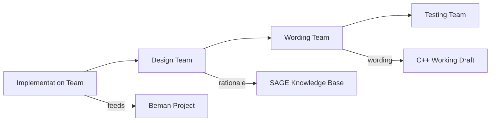
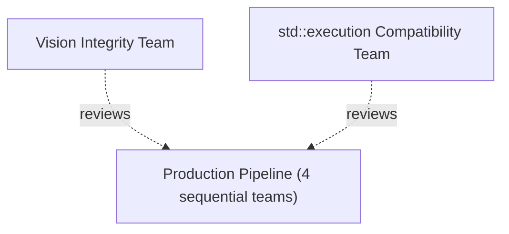

## Abstract

Twenty-one years is long enough.

The Network Endeavor ([P4100R0](https://www.open-std.org/jtc1/sc22/wg21/docs/papers/2026/p4100r0.pdf)[1]) defines the work: eleven papers, two stages, two libraries shipping today. This paper proposes how to do the work - a production pipeline, a continuous workflow, and an open invitation to the people whose expertise can make it succeed. The committee has the talent. The implementations exist. The only missing ingredient is coordination.

---

## Revision History

### R0: May 2026 (pre-Brno mailing)

- Initial version.

---

## 1. Disclosure

The author provides information and serves at the pleasure of the committee.

This paper is part of the [Network Endeavor](https://www.open-std.org/jtc1/sc22/wg21/docs/papers/2026/p4100r0.pdf) ([P4100R0](https://www.open-std.org/jtc1/sc22/wg21/docs/papers/2026/p4100r0.pdf)[1]), a project to bring coroutine-native I/O to C++.

The lead author developed and maintains [Capy](https://github.com/cppalliance/capy) and [Corosio](https://github.com/cppalliance/corosio) and believes coroutine-native I/O is a practical foundation for networking in C++.

Coroutine-native I/O and `std::execution` are complementary. Each serves the domain where its design choices pay off.

This paper asks for nothing.

---

## 2. The Moment

The committee has been trying to standardize networking since [N1925](https://www.open-std.org/jtc1/sc22/wg21/docs/papers/2005/n1925.pdf)[2] (2005). The Networking TS reached publication in 2018. It was not merged. The executor unification effort consumed a decade. Networking waited.

The committee polled twice on whether a single async model should govern the entire standard library. Neither poll achieved consensus ([P2453R0](https://www.open-std.org/jtc1/sc22/wg21/docs/papers/2022/p2453r0.html)[3]). The committee has two async models - `std::execution` ships in C++26, and `std::execution::task` is both a coroutine and a sender. The price of two models has already been paid.

C++29 is the target. The Network Endeavor ([P4100R0](https://www.open-std.org/jtc1/sc22/wg21/docs/papers/2026/p4100r0.pdf)[1]) defines the work: eleven papers backed by two shipping libraries - Capy and Corosio - with independent adopters at various stages: one experimental port completed (Redis), one v2 planned (MySQL), one building on Corosio from day one (Postgres). The companion papers document the technical foundations: coroutine properties ([P4088R0](https://www.open-std.org/jtc1/sc22/wg21/docs/papers/2026/p4088r0.pdf)[4]), domain separation ([P4099R0](https://www.open-std.org/jtc1/sc22/wg21/docs/papers/2026/p4099r0.pdf)[5]), and sender-coroutine bridges ([P4092R0](https://www.open-std.org/jtc1/sc22/wg21/docs/papers/2026/p4092r0.pdf)[6], [P4093R0](https://www.open-std.org/jtc1/sc22/wg21/docs/papers/2026/p4093r0.pdf)[7]).

The work is defined. What remains is the question every large institution eventually faces: can we organize ourselves to deliver?

This paper is the Network Endeavor's organizational proposal. It is authored by the endeavor's architects. The pipeline, the teams, and the workflow are our design. The invitation to the `std::execution` architects and to the broader committee is genuine - the endeavor cannot succeed without their expertise, and their requirements must be addressed. But this is our proposal, not a jointly authored plan. We are asking the committee to let us do the work, with every stakeholder's requirements visible, documented, and addressed at every stage.

---

## 3. Prerequisites

Two agreements must hold before the pipeline described in this paper can function. Both are the subject of companion papers. This paper does not relitigate them - it assumes they are accepted and builds on them.

### 3.1 Domain Partition

Coroutine-native I/O serves byte-oriented networking. `std::execution` serves GPU dispatch, heterogeneous execution, and compile-time work graphs. Two models, each correct for its domain. The technical basis is documented in [P4088R0](https://www.open-std.org/jtc1/sc22/wg21/docs/papers/2026/p4088r0.pdf)[4] and [P4099R0](https://www.open-std.org/jtc1/sc22/wg21/docs/papers/2026/p4099r0.pdf)[5].

Domain specialization is not fragmentation. C++ has multiple container types, multiple string types, multiple smart pointer types. GPU compute has `nvexec` with CUDA extensions and a separate namespace. Two async models for two distinct domains is the same principle the committee has applied throughout the standard.

### 3.2 Interoperability Commitment

Both models must interoperate. Coroutine-native code must be able to consume senders. Sender-based code must be able to consume awaitables. The bridge papers ([P4092R0](https://www.open-std.org/jtc1/sc22/wg21/docs/papers/2026/p4092r0.pdf)[6], [P4093R0](https://www.open-std.org/jtc1/sc22/wg21/docs/papers/2026/p4093r0.pdf)[7]) have explored the mechanisms. The cost is acknowledged by both sides: the coroutine side accepts that interop is a hard requirement; the sender side accepts that coroutine-native I/O makes different trade-offs - frame allocation, type erasure, ABI stability - that serve networking's specific needs.

### 3.3 Architectural Coherence

The Networking TS was compromised by successive design demands that eroded its architectural coherence ([P4094R0](https://www.open-std.org/jtc1/sc22/wg21/docs/papers/2026/p4094r0.pdf)[8]). The stream model, the buffer sequences, and the executor architecture were each sound. The accumulated weight of unification requirements - each individually reasonable - produced a design that could not ship.

This endeavor maintains structural safeguards to prevent that pattern from recurring. Section 5 describes them.

---

## 4. A New Way of Working

The committee's traditional workflow is meeting-centric: papers are published in mailings, discussed at plenary meetings three times a year, and revised between meetings by their authors. For a single paper, this works. For an eleven-paper series with cross-cutting dependencies, it is too slow.

This paper proposes a continuous workflow that operates between meetings and delivers visible progress at every stage.

### 4.1 Communication

- **Mattermost** - A dedicated instance with channels for each team (Section 5). Real-time collaboration, asynchronous by default. No mandatory meetings. Synchronous calls when a team needs them, not on a fixed schedule.
- **SG4 and LEWG mailing lists** - Formal discussion of design decisions that affect the committee's direction.
- **The Reflector** - Committee-wide announcements and cross-team coordination.

### 4.2 Artifacts

- **A shared GitHub repository** for papers, design documents, specs, and rationale. Every artifact is version-controlled and publicly visible.
- **Non-WG21 contributors** can participate in testing, wording review, and implementation. The repository is open.
- **Every design decision** is documented with its rationale - including dissenting views and the reasons disagreements were resolved. The record is complete.

### 4.3 Implementation

- **The Beman Project** serves as the reference implementation vehicle. As papers move through the pipeline, the implementation team contributes to Beman continuously.
- **Cross-platform CI**, test suites, and benchmarks are available to the committee at every stage. The committee can clone the repo and run the tests.

### 4.4 Knowledge Preservation

- **WG21 SAGE** captures the reasoning behind every decision, so future revisits have full context.
- Rationale is documented at every decision point. Not just what was decided, but why - and what alternatives were considered and rejected.
- Institutional knowledge is a first-class deliverable alongside the feature itself. When this endeavor is complete, the committee will have not just networking in the standard, but a complete record of how it got there.

---

## 5. The Pipeline

Six teams. Four in a sequential production pipeline. Two cross-cutting review teams.

The production pipeline runs left to right. Each team transforms the previous team's artifact and emits a public output:

Two review teams cut across the entire pipeline:

### 5.1 Implementation Team

Examines Capy and Corosio - the working code. Writes a spec: what the libraries do, how they do it, what the interfaces are, what the invariants are. The spec is a faithful description of deployed behavior, not a design document. The spec is the input to the Design Team.

### 5.2 Design Team

Takes the spec and determines the standard shape. What belongs in `std`? What are the concepts, the type requirements, the customization points? Where does the design differ from the implementation and why? Sender interop, allocator policy, error model, and ABI boundaries are decided here.

### 5.3 Wording Team

Takes the standard shape and produces formal wording for the C++ Working Draft. Clause structure, stable names, cross-references, editorial conventions. This is LWG-quality prose.

### 5.4 Testing Team

Takes the wording and debugs it. Writes test cases against the wording - not the implementation. Finds ambiguities, contradictions, and missing edge cases. This team is open to non-WG21 members. Anyone who can read a specification and write a test is welcome. Issues found here are returned to the Wording Team for revision.

### 5.5 Vision Integrity Team

Ensures the result preserves the architectural properties that make the design work: type erasure, ABI stability, separate compilation, and the three-layer architecture documented in [P4100R0](https://www.open-std.org/jtc1/sc22/wg21/docs/papers/2026/p4100r0.pdf)[1] Section 6. Reviews every output of the pipeline for architectural coherence.

The Networking TS lost its architectural coherence through successive compromises, each individually reasonable ([P4094R0](https://www.open-std.org/jtc1/sc22/wg21/docs/papers/2026/p4094r0.pdf)[8]). This team exists so that does not happen again. The Capy and Corosio architects staff this team.

### 5.6 `std::execution` Compatibility Team

Ensures every artifact produced by the pipeline has a clean bridge to `std::execution`. Reviews the spec, the standard shape, and the wording at every stage. Guarantees that coroutine-native awaitables can be consumed from sender-based code and vice versa. Documents the bridge cost at each boundary.

The reciprocal commitment: the pipeline teams accept that interoperability with `std::execution` is a hard requirement and design for it. The Compatibility Team accepts that coroutine-native I/O makes different trade-offs and does not require that networking adopt sender semantics internally. Both sides acknowledge the cost. Both sides get a voice.

### 5.7 Continuous Production

Each team works paper by paper. The eleven papers flow through the pipeline. Multiple papers occupy different stages simultaneously - Paper 1 in Wording while Paper 2 is in Design while Paper 3 is in Implementation. Every handoff produces a visible artifact in the GitHub repository.

---

## 6. The People

WG21 has enormous talent. The following teams reflect the work areas. The Vision Integrity Team is staffed by the Capy and Corosio architects. All other teams are open - anyone whose expertise aligns with the work is welcome.

### 6.1 Vision Integrity Team

| Person            | Affiliation  | Demonstrated Strengths                          |
| ----------------- | ------------ | ----------------------------------------------- |
| Vinnie Falco      | C++ Alliance | Capy/Corosio architect; Network Endeavor author |
| Steve Gerbino     | C++ Alliance | Corosio co-author; constructed comparisons      |
| Mohammad Nejati   | C++ Alliance | Corosio co-author; platform backends            |
| Mungo Gill        | C++ Alliance | Capy co-author; frame allocator propagation     |
| Michael Vandeberg | C++ Alliance | Corosio co-author                               |

### 6.2 `std::execution` Compatibility Team

| Person | Affiliation | Demonstrated Strengths |
| ------ | ----------- | ---------------------- |
| TBD    |             |                        |

### 6.3 Implementation Team

| Person | Affiliation | Demonstrated Strengths |
| ------ | ----------- | ---------------------- |
| TBD    |             |                        |

### 6.4 Design Team

| Person | Affiliation | Demonstrated Strengths |
| ------ | ----------- | ---------------------- |
| TBD    |             |                        |

### 6.5 Wording Team

| Person | Affiliation | Demonstrated Strengths |
| ------ | ----------- | ---------------------- |
| TBD    |             |                        |

### 6.6 Testing Team

| Person | Affiliation | Demonstrated Strengths |
| ------ | ----------- | ---------------------- |
| TBD    |             |                        |

---

## 7. Corporate Stakeholders

Networking in C++ affects every company that deploys C++ at scale. This endeavor explicitly invites corporate stakeholders to put their requirements on the table - openly, at every stage.

| Organization | Stake |
| ------------ | ----- |
| TBD          |       |

If a company needs something from the design, they say so. The requirement is documented, visible, and addressed. No hidden agendas. Every stakeholder's cards are on the table.

---

## 8. The Pipeline in Motion

[P4100R0](https://www.open-std.org/jtc1/sc22/wg21/docs/papers/2026/p4100r0.pdf)[1] Section 11 defines the timeline: all eleven papers through LEWG by end of 2028, LWG wording through 2029H1. The pipeline maps onto that timeline.

Multiple papers occupy different pipeline stages simultaneously. While Paper 1 (Coroutines for I/O) is in Wording review, Paper 2 (I/O Buffer Ranges) can be in Design, and Paper 3 (Stream Concepts) can be in Implementation. The Beman Project receives implementation output continuously. Each handoff produces a visible artifact in the GitHub repository.

The eleven papers divide into two stages that mirror the library split:

**Stage One** (Papers 1-4) - Pure C++20 abstractions. No platform dependency. Coroutine execution protocol, buffer concepts, stream concepts, coroutine runtime. These enable sans-I/O protocols in the ecosystem.

**Stage Two** (Papers 5-11) - Platform I/O. Timers, signals, files, TCP, DNS, UDP, TLS. The first three papers in Stage Two have nothing to do with networking. The committee can standardize seven papers before anyone says the word "socket."

If C++29 proves too aggressive, the Stage One papers deliver standalone value for C++32. The committee ships what is ready. Each paper that completes the pipeline is a shippable unit - the endeavor does not require all eleven papers to succeed for any of them to succeed. Partial delivery is still delivery. The ecosystem benefits from coroutine execution protocol and buffer concepts whether or not TLS makes the same standard.

---

## 9. The Stakes

This is not just about shipping a feature.

The committee has been perceived - by its own members, by the broader C++ community, and by observers in other language ecosystems - as unable to coordinate large efforts. Networking is the longest-running example. Twenty-one years from first proposal to the present, and the standard has no sockets, no DNS, no TLS.

The talent exists. The implementations exist. The technical foundations are documented. The bridge mechanisms are explored. What has been missing is a way of working that lets the committee's collective expertise converge on a shared goal instead of diverging into competing visions.

If this endeavor succeeds, the committee will have delivered networking for C++29. That alone justifies the effort. But the committee will also have demonstrated something larger: that WG21 can organize a multi-year, multi-team, cross-faction effort and ship the result. That is a model the committee can use again - for reflection, for pattern matching, for whatever comes next.

The work is defined. The people are here. The question is whether we choose to do this together.

---

## Acknowledgments

The authors of `std::execution` - Eric Niebler, Kirk Shoop, Lewis Baker, Lee Howes, Micha&lstrok; Dominiak, Michael Garland, Bryce Adelstein Lelbach, and their collaborators - invested years in a principled async framework for C++. Their work on sender/receiver serves domains where compile-time composition and heterogeneous dispatch matter. This endeavor builds alongside that work and depends on their expertise for interoperability.

Chris Kohlhoff designed Asio's stream model, buffer sequences, and executor architecture. Twenty years of production deployment is the foundation this work builds on.

The committee designed C++20 coroutines. Gor Nishanov, Lewis Baker, and their collaborators gave C++ the language mechanisms that make coroutine-native I/O possible.

Dietmar K&uuml;hl's work on sender-based networking ([P2762R2](https://www.open-std.org/jtc1/sc22/wg21/docs/papers/2023/p2762r2.pdf)[9]) and the coroutine task type ([P3552R3](https://www.open-std.org/jtc1/sc22/wg21/docs/papers/2025/p3552r3.html)[10]) explored the design space from the sender side. That exploration informs the bridge design.

Mark Hoemmen's stewardship of `std::execution` through C++26 demonstrated the sustained effort required to shepherd a large proposal through the committee process.

The Beman Project, led by David Sankel, provides the reference implementation infrastructure that makes continuous production possible.

Peter Dimov, Andrzej Krzemie&#324;ski, John Lakos, Howard Hinnant, Nina Ranns, Nicolai Josuttis, Jonathan M&uuml;ller, Ville Voutilainen, and Inbal Levi bring decades of library design, wording, and process expertise that this endeavor cannot succeed without.

Ruben Perez, Marcelo Zimbres Silva, Klemens Morgenstern, and the Boost.Postgres team adopted Capy and Corosio independently. Their experience is evidence that cannot be manufactured.

Steve Gerbino, Mohammad Nejati, Mungo Gill, and Michael Vandeberg co-authored the libraries that make this proposal concrete rather than aspirational.

---

## References

[1] [P4100R0](https://www.open-std.org/jtc1/sc22/wg21/docs/papers/2026/p4100r0.pdf) - "Coroutine-Native I/O for C++29 (The Network Endeavor)" (Vinnie Falco, Steve Gerbino, Michael Vandeberg, Mungo Gill, Mohammad Nejati, 2026).

[2] [N1925](https://www.open-std.org/jtc1/sc22/wg21/docs/papers/2005/n1925.pdf) - "Networking proposal for TR2 (rev. 1)" (Gerhard Wesp, 2005).

[3] [P2453R0](https://www.open-std.org/jtc1/sc22/wg21/docs/papers/2022/p2453r0.html) - "2021 October Library Evolution Poll Outcomes" (Bryce Adelstein Lelbach, Fabio Fracassi, Ben Craig, 2022).

[4] [P4088R0](https://www.open-std.org/jtc1/sc22/wg21/docs/papers/2026/p4088r0.pdf) - "What C++20 Coroutines Already Buy The Standard" (Vinnie Falco, 2026).

[5] [P4099R0](https://www.open-std.org/jtc1/sc22/wg21/docs/papers/2026/p4099r0.pdf) - "The Twenty-One Year Networking Arc" (Vinnie Falco, 2026).

[6] [P4092R0](https://www.open-std.org/jtc1/sc22/wg21/docs/papers/2026/p4092r0.pdf) - "Consuming Senders from Coroutine-Native Code" (Vinnie Falco, Steve Gerbino, 2026).

[7] [P4093R0](https://www.open-std.org/jtc1/sc22/wg21/docs/papers/2026/p4093r0.pdf) - "Producing Senders from Coroutine-Native Code" (Vinnie Falco, Steve Gerbino, 2026).

[8] [P4094R0](https://www.open-std.org/jtc1/sc22/wg21/docs/papers/2026/p4094r0.pdf) - "The Unification of Executors and P0443" (Vinnie Falco, 2026).

[9] [P2762R2](https://www.open-std.org/jtc1/sc22/wg21/docs/papers/2023/p2762r2.pdf) - "Sender/Receiver Interface For Networking" (Dietmar K&uuml;hl, 2023).

[10] [P3552R3](https://www.open-std.org/jtc1/sc22/wg21/docs/papers/2025/p3552r3.html) - "Add a Coroutine Task Type" (Dietmar K&uuml;hl, Maikel Nadolski, 2025).

