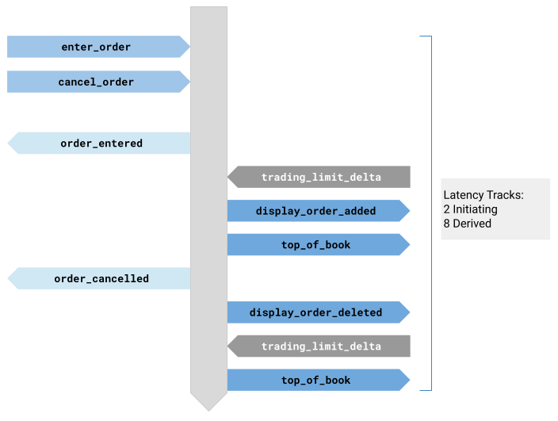
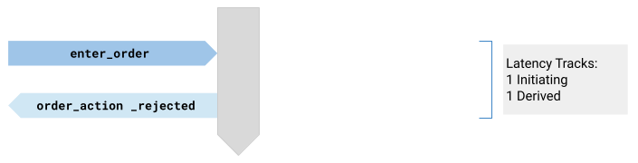
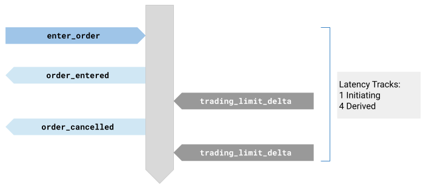
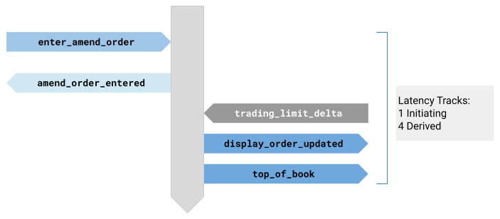
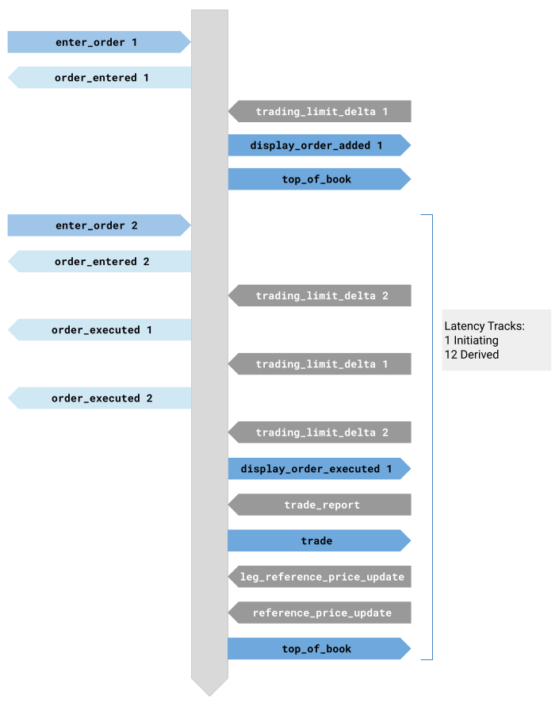
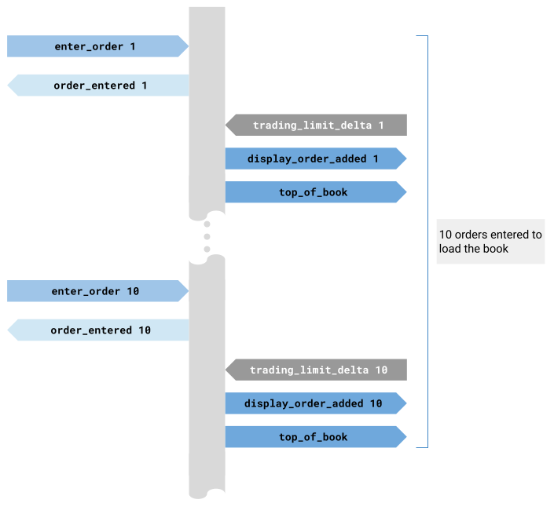
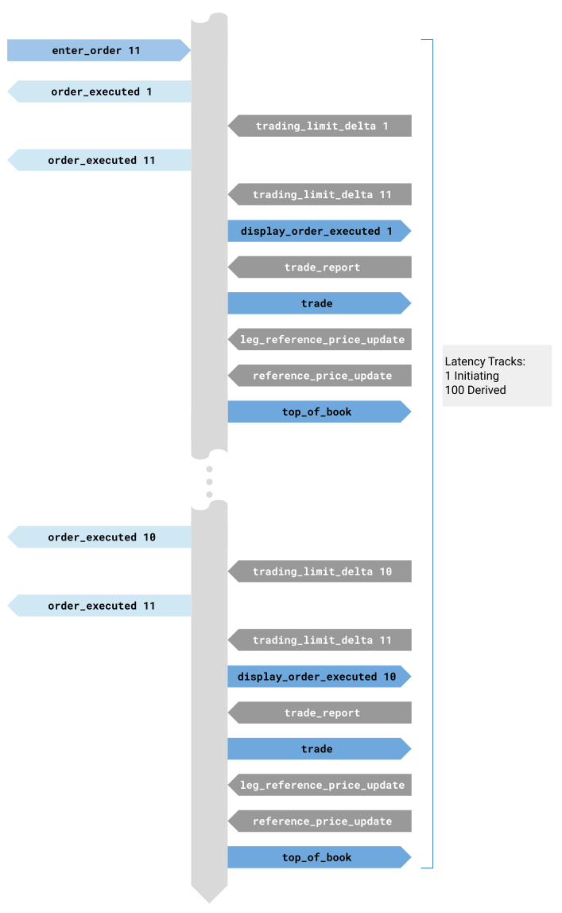
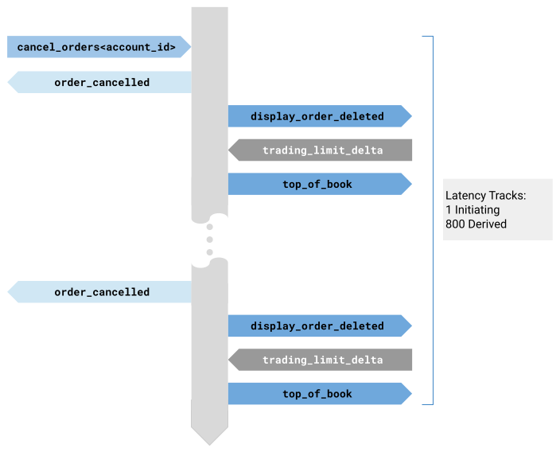

## Abstract

A derivatives exchange is porting from Asio callbacks to coroutine-native I/O. Early results: it works.

The paper reports qualitative findings from three structured interviews with the engineering team and early quantitative results from the integration partner's matching facility benchmark suite. The qualitative findings were reported in R0; this revision adds scenario-based latency and throughput comparisons between Corosio and Asio. The results are preliminary - the integration covers a subset of the platform and full production deployment has not occurred - but the field evidence is reported here for the committee's consideration.

---

## Revision History

### R1: May 2026 (pre-Brno mailing)

- Added Section 7 (Viability Assessment) with early quantitative benchmark results from the integration partner's matching facility scenarios.
- Updated scope description and limitations to reflect progress since R0.

### R0: April 2026 (post-Croydon mailing)

- Initial version. Early-stage qualitative findings only.

---

## 1. Disclosure

The author provides information and serves at the pleasure of the committee.

This paper is part of the Network Endeavor ([P4100R0](https://www.open-std.org/jtc1/sc22/wg21/docs/papers/2026/p4100r0.pdf)[4]), a project to bring coroutine-native I/O to C++.

Falco developed and maintains [Capy](https://github.com/cppalliance/capy)[1] and [Corosio](https://github.com/cppalliance/corosio)[2] and believes coroutine-native I/O is a practical foundation for networking in C++.

The author is affiliated with the C++ Alliance, which develops the libraries under test. The integration partner is an independent commercial entity. The evidence is early-stage and the authors acknowledge its limitations explicitly in Section 8.

This paper asks for nothing.

---

## 2. Background

The integration involves a commercial derivatives exchange operator porting from Boost.Asio to a coroutine-native library developed by the C++ Alliance.

### 2.1 The Integration Partner

The integration partner has developed one of the world's highest performance derivatives exchange platforms. The platform supports 24/7 markets across all major asset types and is considered "equities grade" but with full derivative support including options. It was built by engineers who pioneered modern exchange architecture and who were behind the tech stacks that underpin markets such as NYSE, NASDAQ, and HKEx.

The primary codebase comprises numerous repositories (primarily C++), with Boost.Asio as a foundational process building block for application pipelines and session management. The majority of the code uses Asio callbacks; a small island of coroutine code exists in the most performance-critical path. As is standard practice in low-latency financial markets infrastructure, the organisation does not use exceptions in production code.

### 2.2 The Libraries Under Test

Capy is a C++ library providing async/coroutine building blocks and executor models. Corosio is a networking library built on Capy, providing async socket operations. Both are designed with C++20 coroutines as first-class citizens and are described in detail in [P4003R3](https://isocpp.org/files/papers/P4003R3.pdf)[3]. The key design commitment is: coroutines only. No callbacks, futures, or sender/receiver interfaces. Every I/O operation returns an awaitable.

### 2.3 Scope and Limitations of the Integration

The port focuses on a subset of repositories needed to re-run the partner's matching facility benchmark tests with Corosio replacing Asio. The scope covers core executor, IO context, and TCP socket functionality. WebSocket support - required for external client connectivity - is not yet available in Corosio and is excluded from this evaluation.

The project is structured in phases: foundational library porting first, then TCP client/server components, then benchmark execution. The central research question is whether a coroutine-native I/O library can match or exceed Asio's performance in a mission-critical production system. The benchmarking phase for the matching facility component has completed and results are reported in Section 7. Broader system components (order entry gateways, market data distributors) have not yet been benchmarked.

---

## 3. Methodology

### 3.1 Qualitative Interviews

Three structured interviews were conducted with members of the integration partner's engineering team in March 2026:

- **Engineer A** (CEO, highly experienced C++ engineer): ~90 minute interview covering build integration, incremental adoption strategy, and architectural assessment.
- **Engineer B** (platform architect): ~70 minute interview covering callback-to-coroutine migration, error handling, and production readiness assessment.
- **Engineer C** (developer, newer to the codebase): ~55 minute interview covering build experience, documentation quality, timer migration, and coroutine design assessment. Engineer C had no prior production experience with C++ coroutines.

Engineers A and B had been working with Capy and Corosio for approximately two weeks at the time of their interviews. Engineer C was interviewed one week later. All quotes are from interview transcriptions, lightly edited for readability. A project journal maintained by the engineering team provided supplementary context.

The interviews were qualitative. No metrics, benchmarks, or automated measurements are reported in Sections 4-6. The findings represent the subjective assessments of three engineers at the early stage of an ongoing integration. They carry the weight appropriate to their scope.

All interviews were conducted remotely over video call; the Capy/Corosio author was present for technical questions but did not participate in the assessment discussions.

### 3.2 Scenario Benchmarks

Following the qualitative interview phase, the integration partner completed a porting effort sufficient to run their matching facility benchmark suite against both backends. The benchmarks use representative (not realistic) scenarios - deterministic, canned message sequences designed to exercise specific code paths under consistent conditions. Each scenario was run at multiple message injection rates and with both an empty and a pre-filled order book.

The same hardware and deployment configuration was used for both backends. Results are reported as percentage deltas (Corosio relative to Asio) rather than absolute values, both because the delta directly answers the viability question and because absolute values are proprietary. The integration partner computed and provided the delta figures.

---

## 4. Callback-to-Coroutine Migration

The partner's codebase is predominantly callback-based. The following subsections report how the transition to coroutines proceeded in practice.

### 4.1 Transition Difficulty

Migrating production callback-based code to coroutines was feasible and less disruptive than anticipated.

> "It was actually easier than expected." - Engineer B

> "The actual move from callbacks to coroutines took a bit of thought but it was overall not a massive change." - Engineer B

> "The changes we've had to make haven't been as drastic as maybe once thought." - Engineer B

Engineer C, working independently on a different part of the codebase, reached the same conclusion:

> "It was easier than expected I think." - Engineer C

Recursive callback patterns (retry loops, reconnection handlers) converted naturally to structured coroutine loops, which the engineers described as simpler and more readable than the callback originals.

### 4.2 Timer Migration

Engineer C's work focused on replacing Asio timer callbacks with coroutine equivalents. The Asio pattern uses recursive callbacks - a timer fires, executes a handler, and re-arms itself within the same handler. This pattern does not translate directly to coroutines:

> "We relied on an Asio callback which does a recursive thing - it's kind of like set up the timer and it expires on a given interval, keeps re-entering the same function. But with coroutines I don't think you can do that recursively." - Engineer C

Engineer C considered symmetric transfer but concluded it was not the right fit for this pattern. The correct coroutine equivalent is a simple loop with `co_await` on each timer expiry - a structurally simpler construct, but one that requires recognising the pattern translation.

### 4.3 Incremental Adoption

Engineer A designed a "springboard function" approach to insulate the existing callback codebase from requiring full coroutine propagation:

> "Can I just do a springboard function? So if I have a Capy-style executor and I need to call a coroutine, can I just wrap that in a box and pretend I didn't do that?" - Engineer A

> "This might be a path that other people could follow. It's a band-aid. We know that." - Engineer A

The approach uses an `executor_traits` abstraction layer allowing parallel Asio and Capy implementations. Tests run identically against both backends, validating behavioural equivalence. The dual-backend approach allowed the team to port incrementally without disrupting the existing Asio codebase.

### 4.4 Coroutine-Only Design

Engineer B endorsed the coroutine-only design philosophy:

> "The tradeoffs around callbacks versus coroutines - if you've got a sufficiently modern codebase, I think there's a very strong reason that you could choose the coroutine route and have very little tradeoff." - Engineer B

> "Doing one thing and doing it very well and focusing just on that, I think, has a lot of merit." - Engineer B

Engineer C found the coroutine model more intuitive to write but was more cautious about its fit with existing code:

> "It feels like there's a ground up approach with Capy and the use of the tasks which is really easy to use and it feels like it's quite easy to start constructing a larger application. But I'm still not sure how it fits into an existing application." - Engineer C

### 4.5 Build Experience

Engineer C reported a straightforward build experience. The CMake snippet in the repository README compiled cleanly on the first attempt, and the dependency relationship between Capy and Corosio was handled automatically. Time from source code to a running programme was less than one hour. Compilation times were not noticeably different from Asio.

### 4.6 Documentation

Documentation was generally praised. Engineer C, who had no prior coroutine experience, found the introductory topics in Capy on coroutines and concurrency brought him up to speed effectively. He compared the documentation favourably to Asio's:

> "With the Capy documentation there's obviously a lot more of a background explained with your documents." - Engineer C

Areas identified for improvement included the stream concepts section (which assumed background knowledge the developer did not have) and code examples (which could benefit from wider context - full programmes rather than isolated snippets). These are documentation issues, not library design issues, but they affect adoption.

---

## 5. Error Handling

Engineer B's primary friction point was error handling. Corosio throws exceptions where Asio provides `error_code` overloads.

> "In some cases in Corosio and Capy, I think there's only exceptions. It would be actually quite nice if you were able to either pass in an error code that gets updated or return an error code. The one I'm thinking of is socket set_option - it only throws." - Engineer B

> "We don't use exceptions at all. In some very non-intensive bits of code we'll maybe use exception handling, but overall we don't use that. Having a consistent way to report errors would be a worthwhile set of updates." - Engineer B

The exception-vs-error-code boundary is a recurring design question in C++ I/O libraries. This question is directly relevant to financial markets infrastructure, where exception-free code paths are a standard requirement.

---

## 6. Early Assessment

Engineer A's assessment is exploratory - the springboard approach needs performance validation:

> "We might surprisingly find that actually it is feasible to take this approach. And this might be a path that other people could follow." - Engineer A

Engineer B's assessment is more confident:

> "I think this is a viable production replacement. So far, at least from what we've seen - not that we've had gigabytes of traffic flowing through this thing yet - but definitely the way it's been written, the way we've been porting code across to it, the way the tests continue to work... I would be quite confident that it would be robust and a reasonable alternative or replacement." - Engineer B

> "It doesn't feel brittle. It feels like it's been quite well thought out, and the changes we've had to make around some of this stuff haven't been excruciating." - Engineer B

> "I would definitely not steer anyone away from it after what I've experienced so far." - Engineer B

Engineer C's assessment was more measured - he is earlier in the integration process and working on a narrower scope:

> "I would say it's felt like a smooth process so far." - Engineer C

> "We'd have to be sure that production or similar deployment of all our existing components have the same behaviour. So that's still a while off." - Engineer C

When asked what he would warn another team considering the port:

> "I'd probably warn about the length of time that it would take. Wondering whether trading off the length of time would be worth it." - Engineer C

Engineers B and C both noted caveats for teams with deeply entrenched Asio codebases - particularly those with complex multi-threading and multiple thread pools, where the migration would be substantially harder. The time investment required for a complete port should not be underestimated.

Engineer A also noted the library's accessibility:

> "This library is probably something a new user could turn to and use pretty much directly." - Engineer A

These assessments were based on two to three weeks of integration work covering a subset of the platform. At the time of the interviews, no performance benchmarks had been completed. The qualitative assessments above are early indicators, not final verdicts. The quantitative evidence that followed is reported in Section 7.

---

## 7. Viability Assessment

This section extends the qualitative findings reported above with early quantitative evidence from the integration partner's matching facility benchmark suite. The content has been distilled from conversations with, and write-ups provided by, the partner's engineering and delivery teams. A direct experience report authored by the partner is planned; the purpose of this section is to share their findings after having completed a significant phase of the porting effort.

### 7.1 Rationale and Drivers

The integration partner reports that the porting exercise is not a theoretical evaluation but a pathway to addressing specific refactorability constraints in their codebase.

The platform is architected as an ultra-low latency message passing stack. It uses Asio as the core networking library - a choice the partner describes as the "gold standard" for such systems. The callback approach is the primary implementation mechanism, largely because it was the main approach available when the code was initially written (pre-C++20 coroutines). In some cases the codebase uses Asio coroutines where performance and readability benefits justified that decision.

The partner has a layered architecture implementing networking, transport, session management, and application pipeline protocol layers. One challenge they have faced over the years is separating these implementations to allow re-use across transport layers (TCP, WebSocket, UDP) without the difficulties imposed by weaving that into a layer-traversing callback architecture. In the partner's assessment, this has resulted in increasingly hard-to-reason-about abstractions and difficulty testing those abstractions.

The partner's goals for the port are twofold: (a) establish that performance and capability criteria are met, and (b) assess whether the layering benefits of a coroutine-first approach can unlock their ability to improve the ability to encapsulate and decouple the layered code across the codebase. The partner reports that their inability to achieve this refactoring within the callback architecture - without taking on significant time commitment and producing something "similar but different" with no real benefit - has postponed such work continually, resulting in hard-to-remove technical debt.

### 7.2 Why Not Sender/Receivers?

For additional context on why the coroutine-native path was chosen, we asked the integration partner why they had not previously considered sender/receivers given the attention it has received in the committee as a potential foundational building block. The following is a summary of their response. The partner states that it should be considered opinion only, and notes that they have not been keeping up-to-date with all the latest changes to sender/receivers - some things may have changed.

The partner's architecture is essentially a message passing architecture, which is the norm for high performance financial market systems targeting ultra-low latency and high message throughput. In the partner's view, sender/receivers is an opinionated structured concurrency model that chooses specific trade-offs which are at odds with their existing architecture. They acknowledge that those choices have their benefits in other domains and in more general applications, but state that they create friction in the context of their architecture.

The partner also expressed the view that the sender/receivers model does not scale across their architecture as a whole - for example, across multiple deployed components - and forces a set of design choices that make porting more of a rewrite than an incremental refactoring. In their assessment, the approach conflates a number of concerns, such as providing a pipeline model that is not equivalent to a full-fledged message passing pipeline (for which the partner has its own mature library).

Regardless of the complexity of any potential port (which the partner characterises as closer to a complete rewrite), the trade-off choices already represent a forced compromise on the existing architecture. This removed any potential performance motivation from the outset. Further, the invasive nature of such a change would impact too many libraries to make the effort feasible to validate from a behavioural point of view, as there would be fundamental changes required to message pathways.

Lastly, the partner expressed concern over the expression syntax used to compose pipelines in sender/receivers, stating that it caused many mental "trips" when trying to reason about what was happening. In their view, it may be adequate for simple examples but does not appear to scale, and is not comparable or compatible with the kind of pipeline architecture they use.

### 7.3 Migration Approach

The partner identified two key code paths affected by the port:

- **Application Management pathway**: delivers each component's core application and process behaviours (timers, thread model, signal handling, process management). Not performance-critical; the emphasis is on correctness.
- **Application Pipeline pathway**: delivers each component's main application pipeline and is responsible for all networking activities and message passing within the system. Performance-critical.

The migration approach was the same for each pathway:

1. Develop a parallel Corosio/Capy implementation mirroring behaviour of each library in the dependency tree.
2. Update and augment tests for existing Asio code paths so that the same tests run for both backends, proving feature parity and correctness.
3. Augment type management to allow specification and use of Corosio/Capy types over Asio types, offering an incremental migration path.
4. Update build processes to allow testing all code paths and choosing to build Corosio/Capy-based components.

For the Application Management pathway, correctness alone was sufficient to establish viability. For the Application Pipeline pathway, the partner established that the appropriate viability test was to port their Matching Facility scenario benchmark suite - allowing them to spike through the architecture and make a quantitative assessment of whether Corosio could serve as a viable replacement for Asio.

### 7.4 Results and Assessment

Across all eight tested scenarios, the Corosio port of the Application Pipeline pathway produces consistently comparable latency and throughput results to Asio. In the partner's assessment:

- On balance, the Corosio port is very marginally faster in many scenarios at the median and higher percentiles, but not to any level of significance or confidence given the test setup.
- Asio appears to provide marginally lower jitter overall (smaller variance in tail latencies), but this too is marginal and the partner notes that no tuning or configuration has been applied to the Corosio build.
- Across most scenarios, deltas shrink as feed rate increases from 1,000 to unbounded. At the highest rates the backends are nearly indistinguishable. This implies the I/O layer cost becomes a smaller fraction of total processing time under heavy load - the matching logic dominates as expected.

The per-scenario data also reveals some directional patterns worth noting:

- **Scenario 3 (Order Amends)** showed a mean latency penalty of +2.5% to +4.9% across all rates (empty book), making it the only scenario with a sustained directional cost outside of Scenario 8.
- **Scenario 4 (Trade)** showed a P99 advantage for Corosio at sustained rates. At 10k-200k msg/s, P99 latency is 21-27% lower for Corosio (empty book) and 8-24% lower (filled book). The partner noted that although trade-to-quote ratios are usually low, a strong tail-latency profile during sustained trade activity is desirable. The effect reverses at unbounded (saturation) rate, which suggests a difference in how the two backends handle queuing under sustained but sub-saturation load.
- **Sweep scenarios (5, 6, and 7)** showed Corosio's advantage scaling with book traversal complexity. Scenario 5 (same level) had a modest advantage, Scenario 6 (close levels) a smaller one, and Scenario 7 (sparse levels) the strongest and most consistent (mean -2.1% to -3.6%, P99 -3.4% to -6.7%). These results may indicate that coroutine frame locality or reduced callback overhead compounds over complex traversals, but they remain indicative rather than conclusive.
- **Scenario 8 (Mass Cancellation)** showed measurably higher latency for Corosio (-8.7% to -15.4%) under sustained load. The partner considers this a tuning target rather than a fundamental limitation.

The partner has decided that the initial quantitative evidence supports the initial qualitative evidence. They plan to continue their migration effort and explore the refactoring benefits described in Section 7.1. Further analysis - including jitter characterisation, tuning, and testing of additional components (order entry gateways, market data distributors) - will be the subject of a future paper.

The comparative data for all scenarios is presented in Section 7.6.

### 7.5 Scenario Descriptions

The scenarios are scoped to the Matching Facility component of the system. In a typical deployment, Order Entry Gateways fan messages into the Matching Facility, which publishes derived messages to Market Data Distributors for dissemination to participants. The Matching Facility is the most complex part of the stack: one inbound message may result in many outbound messages.

Each scenario was executed with both an empty order book and a pre-filled order book so that the impact of book state can be assessed. The results are intended solely to determine whether the change from Asio to Corosio is viable. The partner notes that there are many further tests that could drill into why differences exist, how impactful they are, and whether they are blockers.

#### Scenario 1 - Place GTC Order and then Cancel

An order is entered using `enter_order` and immediately cancelled (by sequencing ID) before receipt of the `order_entered` acknowledgement. The latency measured spans from the first `enter_order` to the last `top_of_book` update resulting from both messages.

#### Scenario 2 - Enter IOC, No Execution

An Immediate-or-Cancel order is entered. In the empty book case, the order is rejected as invalid (no counterparty).

In the filled book case, the Matching Facility must inspect the book to determine whether execution is possible. The empty book case should be significantly faster because no book inspection occurs.

#### Scenario 3 - Order Amends, Quantity Only

A previously entered order is amended by varying quantity only. Priority is retained in the book and no reordering is required. The difference between empty and filled book cases is the time taken to locate the order in the relevant book.

#### Scenario 4 - Two Orders Resulting in a Trade

One order is entered, then a second is entered to match and trigger an execution resulting in a trade. The processing time is measured from receipt of the triggering order until the last derived message (trade report, price updates, book updates) is published.

#### Scenarios 5, 6, 7 - Sweep 10 Orders

Three sweep scenarios test the same basic flow with different book configurations:

- **Scenario 5**: 10 orders at the same price level.
- **Scenario 6**: 10 orders at close but different price levels.
- **Scenario 7**: 10 orders at sparse (widely separated) price levels.

In each case the book is pre-loaded with 10 orders and then a single order sweeps all of them. One triggering order produces 10 trades and 100 derived messages. The latency measured is the processing time from the triggering execution to the last derived message.

#### Scenario 8 - Mass Cancel Orders across 100 Markets

One hundred tradeable markets are loaded with quotes (buy and sell orders) from a single account. A `cancel_orders` message for that account triggers mass cancellation across all markets. The latency measured includes the triggering message and all derived messages: 4 messages per order cancelled, 2 orders per book, 100 books = 800 derived messages.

### 7.6 Comparative Data

The tables below show the percentage difference in latency and throughput between Corosio and Asio for each scenario. All values compare the `corosio_io_context` backend against the `asio_io_context` backend on identical hardware and consistent conditions.

**Reading the tables:**

- **Feed Rate**: the rate at which messages are injected into the system under test. An infinity symbol indicates unbounded (as fast as the system can process).
- **Count**: the number of events processed in the test run.
- **Min, Max, Mean**: percentage difference in minimum, maximum, and mean end-to-end processing latency.
- **P50, P95, P99**: percentage difference in latency at the 50th, 95th, and 99th percentiles of the latency distribution - i.e. the latency at or below which that percentage of events completed.
- **Avg Rate (events/s)**: percentage difference in sustained event throughput (composite events processed per second, including all derived messages).
- **Avg Rate (orders/s)**: percentage difference in sustained order throughput (initiating orders processed per second).

**Interpretation:**

- For latency columns, a **negative** value means Corosio was faster (lower latency).
- For the Avg Rate columns, a **positive** value means Corosio had higher throughput.
- The Max column tends to be noisy due to test setup and should not be given significant weight.

---

#### Scenario 1 - Place GTC Order and then Cancel

##### Empty Book

| Feed Rate (msg/s) | Count | Min | Max | Mean | P50 | P95 | P99 | Avg Rate (events/s) | Avg Rate (orders/s) |
|--:|--:|--:|--:|--:|--:|--:|--:|--:|--:|
| 1,000 | 10,000 | +3.6% | -0.4% | +0.3% | +0.6% | +3.1% | +3.2% | -0.3% | +0.2% |
| 10,000 | 100,000 | +1.4% | +31.3% | +0.6% | +0.2% | +1.8% | +2.4% | -0.6% | -0.6% |
| 100,000 | 1,000,000 | +0.8% | -7.0% | +0.2% | +0.2% | +0.5% | +0.6% | -0.2% | +0.2% |
| 200,000 | 2,000,000 | -0.8% | +6.0% | +0.2% | +0.2% | +0.7% | +1.0% | -0.2% | +0.2% |
| &#8734; | 2,000,000 | -1.8% | -0.2% | -0.8% | -0.5% | -0.6% | +0.5% | +0.8% | +0.9% |

#### Scenario 1 - Place GTC Order and then Cancel

##### Filled Book

| Feed Rate (msg/s) | Count | Min | Max | Mean | P50 | P95 | P99 | Avg Rate (events/s) | Avg Rate (orders/s) |
|--:|--:|--:|--:|--:|--:|--:|--:|--:|--:|
| 1,000 | 10,000 | -1.0% | +1.5% | +1.0% | +0.8% | +3.5% | +5.1% | -1.0% | -0.7% |
| 10,000 | 100,000 | -2.4% | +86.4% | +0.2% | +0.1% | +2.5% | +4.8% | -0.2% | -1.2% |
| 100,000 | 1,000,000 | +0.0% | +175.9% | +0.7% | +0.7% | +1.0% | +1.6% | -0.7% | +0.0% |
| 200,000 | 1,000,000 | -0.6% | +6.4% | +0.9% | +0.8% | +1.4% | +2.2% | -0.9% | -0.9% |
| &#8734; | 1,000,000 | -3.4% | +13.1% | -2.4% | -2.3% | -2.1% | -1.5% | +2.4% | +1.2% |

#### Scenario 2 - Enter IOC, No Execution

##### Empty Book

| Feed Rate (msg/s) | Count | Min | Max | Mean | P50 | P95 | P99 | Avg Rate (events/s) | Avg Rate (orders/s) |
|--:|--:|--:|--:|--:|--:|--:|--:|--:|--:|
| 1,000 | 10,000 | +2.9% | +4.6% | +0.6% | +0.2% | +2.0% | +3.9% | -0.6% | -0.6% |
| 10,000 | 100,000 | -2.1% | +0.8% | -0.2% | -0.2% | +0.5% | +0.9% | +0.2% | +0.2% |
| 100,000 | 1,000,000 | -1.2% | -4.8% | -0.2% | -0.1% | +0.1% | -0.3% | +0.2% | +0.2% |
| 200,000 | 1,000,000 | +0.2% | -11.9% | +0.4% | +0.2% | +0.4% | +0.0% | -0.3% | -0.3% |
| &#8734; | 1,000,000 | -0.6% | +64.6% | -0.2% | -0.3% | +0.1% | +0.5% | +0.3% | +0.3% |

#### Scenario 2 - Enter IOC, No Execution

##### Filled Book

| Feed Rate (msg/s) | Count | Min | Max | Mean | P50 | P95 | P99 | Avg Rate (events/s) | Avg Rate (orders/s) |
|--:|--:|--:|--:|--:|--:|--:|--:|--:|--:|
| 1,000 | 10,000 | +1.3% | +16.5% | -0.4% | -0.4% | -1.3% | -0.9% | +0.4% | +0.4% |
| 10,000 | 100,000 | +0.4% | +878.6% | +0.7% | +0.6% | -0.1% | +0.8% | -0.6% | -0.6% |
| 100,000 | 1,000,000 | -0.4% | +197.8% | +0.2% | +0.3% | +0.4% | +0.7% | -0.2% | -0.2% |
| 200,000 | 1,000,000 | -1.5% | -64.9% | +0.4% | +0.5% | +0.7% | +0.9% | -0.4% | -0.4% |
| &#8734; | 1,000,000 | -0.8% | -73.8% | +0.2% | +0.2% | +0.1% | +0.4% | -0.2% | -0.2% |

#### Scenario 3 - Order Amends, Quantity Only

##### Empty Book

| Feed Rate (msg/s) | Count | Min | Max | Mean | P50 | P95 | P99 | Avg Rate (events/s) | Avg Rate (orders/s) |
|--:|--:|--:|--:|--:|--:|--:|--:|--:|--:|
| 1,000 | 10,000 | +4.2% | -20.4% | +1.4% | +4.8% | -1.0% | -2.0% | -1.4% | -1.4% |
| 10,000 | 100,000 | +1.8% | -28.8% | +3.4% | +2.6% | +1.8% | +1.7% | -3.3% | -3.3% |
| 100,000 | 1,000,000 | +5.8% | -51.8% | +4.9% | +3.6% | +4.2% | +3.8% | -4.7% | -4.7% |
| 200,000 | 1,000,000 | +4.0% | -75.0% | +4.2% | +3.4% | +3.5% | +3.1% | -4.1% | -4.1% |
| &#8734; | 1,000,000 | +5.5% | -76.4% | +3.7% | +2.4% | +2.5% | +2.0% | -3.6% | -3.6% |

#### Scenario 3 - Order Amends, Quantity Only

##### Filled Book

| Feed Rate (msg/s) | Count | Min | Max | Mean | P50 | P95 | P99 | Avg Rate (events/s) | Avg Rate (orders/s) |
|--:|--:|--:|--:|--:|--:|--:|--:|--:|--:|
| 1,000 | 10,000 | +1.8% | +3.9% | +3.0% | -11.0% | +2.8% | +3.4% | -2.9% | -2.9% |
| 10,000 | 100,000 | +3.7% | -8.2% | +1.5% | -3.5% | +0.3% | +1.6% | -1.5% | -1.5% |
| 100,000 | 1,000,000 | +3.5% | -85.2% | +2.7% | -4.1% | +2.1% | +1.8% | -2.6% | -2.6% |
| 200,000 | 1,000,000 | +4.0% | +610.2% | +2.5% | +13.4% | +1.7% | +0.8% | -2.5% | -2.5% |
| &#8734; | 1,000,000 | +2.5% | +602.0% | +3.0% | -8.5% | +2.0% | +1.2% | -2.9% | -2.9% |

#### Scenario 4 - Two Orders Resulting in a Trade

##### Empty Book

| Feed Rate (msg/s) | Count | Min | Max | Mean | P50 | P95 | P99 | Avg Rate (events/s) | Avg Rate (orders/s) |
|--:|--:|--:|--:|--:|--:|--:|--:|--:|--:|
| 1,000 | 10,000 | -1.1% | -37.8% | -1.2% | -0.5% | -2.6% | -21.2% | +1.2% | -0.5% |
| 10,000 | 100,000 | -0.7% | +18.3% | -3.6% | -3.2% | -3.6% | -26.1% | +3.7% | +4.9% |
| 100,000 | 1,000,000 | -1.8% | -100.0% | -6.4% | -2.2% | -2.5% | -27.2% | +6.9% | +4.7% |
| 200,000 | 1,000,000 | +0.7% | -70.0% | -0.8% | -0.5% | -0.3% | -25.3% | +0.8% | +4.0% |
| &#8734; | 1,000,000 | -0.5% | +5.2% | +0.2% | -1.1% | +1.7% | +36.5% | -0.2% | +3.8% |

#### Scenario 4 - Two Orders Resulting in a Trade

##### Filled Book

| Feed Rate (msg/s) | Count | Min | Max | Mean | P50 | P95 | P99 | Avg Rate (events/s) | Avg Rate (orders/s) |
|--:|--:|--:|--:|--:|--:|--:|--:|--:|--:|
| 1,000 | 10,000 | +0.6% | +287.5% | +0.9% | +1.2% | -1.7% | -8.4% | -0.8% | +2.5% |
| 10,000 | 100,000 | +2.8% | +0.0% | -2.3% | -1.2% | -4.7% | -21.8% | +2.4% | +2.8% |
| 100,000 | 1,000,000 | -0.1% | +620.0% | -0.5% | +0.3% | -2.6% | -22.5% | +0.5% | +1.9% |
| 200,000 | 1,000,000 | +1.3% | -3.2% | -0.3% | +0.3% | -1.7% | -23.7% | +0.2% | +1.4% |
| &#8734; | 1,000,000 | +2.0% | -65.8% | +2.3% | +1.9% | +2.8% | +31.2% | -2.3% | +1.4% |

#### Scenario 5 - Sweep 10 Orders at Same Level

##### Empty Book

| Feed Rate (msg/s) | Count | Min | Max | Mean | P50 | P95 | P99 | Avg Rate (events/s) | Avg Rate (orders/s) |
|--:|--:|--:|--:|--:|--:|--:|--:|--:|--:|
| 1,000 | 2,000 | -4.2% | +25.5% | -6.4% | -6.9% | -6.4% | -3.4% | +6.8% | +1871.7% |
| 10,000 | 50,000 | -1.6% | -20.4% | -0.9% | -0.9% | -1.1% | +7.0% | +0.9% | +3.1% |
| 100,000 | 100,000 | -0.8% | +3.5% | -1.3% | -1.5% | -0.4% | +1.4% | +1.4% | +2.7% |
| 200,000 | 100,000 | -0.2% | +108.0% | -0.9% | -1.0% | -0.2% | -3.6% | +0.9% | +2.6% |
| &#8734; | 100,000 | -1.8% | +115.5% | -1.2% | -1.2% | -0.4% | -4.1% | +1.2% | +2.5% |

#### Scenario 5 - Sweep 10 Orders at Same Level

##### Filled Book

| Feed Rate (msg/s) | Count | Min | Max | Mean | P50 | P95 | P99 | Avg Rate (events/s) | Avg Rate (orders/s) |
|--:|--:|--:|--:|--:|--:|--:|--:|--:|--:|
| 1,000 | 2,000 | +2.1% | +248.3% | +1.0% | +0.7% | -0.6% | +8.5% | -1.0% | +1.0% |
| 10,000 | 50,000 | +0.0% | +1559.3% | +1.0% | +0.8% | +0.8% | -1.1% | -1.0% | +0.5% |
| 100,000 | 100,000 | -0.7% | +3.1% | -0.1% | -0.2% | +0.8% | -5.0% | +0.1% | +0.6% |
| 200,000 | 100,000 | -1.6% | +679.6% | -2.0% | -2.0% | -1.5% | -8.6% | +2.0% | +1.5% |
| &#8734; | 100,000 | -1.8% | +7.0% | -2.4% | -2.4% | -1.8% | -8.2% | +2.5% | +2.5% |

#### Scenario 6 - Sweep 10 Close Orders at Different Levels

##### Empty Book

| Feed Rate (msg/s) | Count | Min | Max | Mean | P50 | P95 | P99 | Avg Rate (events/s) | Avg Rate (orders/s) |
|--:|--:|--:|--:|--:|--:|--:|--:|--:|--:|
| 1,000 | 2,000 | -3.4% | +18.6% | -3.2% | -3.0% | -4.7% | -5.7% | +3.3% | +2135.8% |
| 10,000 | 50,000 | -1.2% | +3.7% | -0.2% | -0.1% | -1.4% | -3.2% | +0.2% | +1.9% |
| 100,000 | 100,000 | +1.3% | -77.8% | -0.2% | -0.2% | -1.3% | -2.7% | +0.2% | +1.4% |
| 200,000 | 100,000 | +0.7% | -17.3% | -0.5% | -0.4% | -1.2% | -2.4% | +0.5% | +2.0% |
| &#8734; | 100,000 | +0.4% | +503.1% | +0.4% | +0.4% | +0.1% | -1.3% | -0.4% | +2.9% |

#### Scenario 6 - Sweep 10 Close Orders at Different Levels

##### Filled Book

| Feed Rate (msg/s) | Count | Min | Max | Mean | P50 | P95 | P99 | Avg Rate (events/s) | Avg Rate (orders/s) |
|--:|--:|--:|--:|--:|--:|--:|--:|--:|--:|
| 1,000 | 2,000 | -0.2% | +0.4% | -2.0% | -2.2% | -2.5% | +2.1% | +2.1% | -0.9% |
| 10,000 | 50,000 | -0.0% | +578.6% | -0.6% | -0.8% | -0.1% | -0.2% | +0.6% | +0.5% |
| 100,000 | 100,000 | -0.4% | +6.3% | -0.5% | -0.4% | -1.3% | -2.9% | +0.5% | +0.6% |
| 200,000 | 100,000 | -0.9% | -15.7% | -0.6% | -0.6% | -1.1% | -2.3% | +0.6% | +1.2% |
| &#8734; | 100,000 | -1.5% | +11.4% | -0.9% | -0.8% | -1.1% | -2.2% | +0.9% | +2.3% |

#### Scenario 7 - Sweep 10 Sparse Orders at Different Levels

##### Empty Book

| Feed Rate (msg/s) | Count | Min | Max | Mean | P50 | P95 | P99 | Avg Rate (events/s) | Avg Rate (orders/s) |
|--:|--:|--:|--:|--:|--:|--:|--:|--:|--:|
| 1,000 | 2,000 | -1.8% | -58.9% | -3.6% | -3.4% | -4.6% | -1.2% | +3.7% | +1848.3% |
| 10,000 | 50,000 | -3.0% | +1.4% | -2.4% | -2.1% | -4.1% | -6.7% | +2.5% | +2.1% |
| 100,000 | 100,000 | -0.4% | -78.8% | -1.8% | -1.6% | -2.2% | -5.3% | +1.8% | +1.5% |
| 200,000 | 100,000 | -2.5% | -3.4% | -3.0% | -2.8% | -3.6% | -6.1% | +3.0% | +1.9% |
| &#8734; | 100,000 | -1.6% | -1.0% | -2.1% | -2.2% | -2.5% | -3.4% | +2.1% | +2.1% |

#### Scenario 7 - Sweep 10 Sparse Orders at Different Levels

##### Filled Book

| Feed Rate (msg/s) | Count | Min | Max | Mean | P50 | P95 | P99 | Avg Rate (events/s) | Avg Rate (orders/s) |
|--:|--:|--:|--:|--:|--:|--:|--:|--:|--:|
| 1,000 | 2,000 | -2.7% | +2.0% | -3.5% | -3.6% | -4.1% | +0.8% | +3.6% | -7.9% |
| 10,000 | 50,000 | -2.4% | -60.3% | -3.6% | -3.3% | -5.8% | -12.8% | +3.7% | +2.9% |
| 100,000 | 100,000 | -1.1% | +516.3% | -2.0% | -1.8% | -2.4% | -6.3% | +2.0% | +1.1% |
| 200,000 | 100,000 | -0.9% | +9.3% | -2.4% | -2.2% | -2.9% | -6.9% | +2.5% | +1.7% |
| &#8734; | 100,000 | -2.9% | +0.5% | -2.8% | -2.7% | -3.3% | -6.2% | +2.9% | +2.6% |

#### Scenario 8 - Mass Cancel Orders across 100 Markets

##### Empty Book

| Feed Rate (msg/s) | Count | Min | Max | Mean | P50 | P95 | P99 | Avg Rate (events/s) | Avg Rate (orders/s) |
|--:|--:|--:|--:|--:|--:|--:|--:|--:|--:|
| 1,000 | 500 | +0.9% | +80.1% | +2.7% | +2.6% | +1.8% | +2.0% | -2.6% | +150.7% |
| 10,000 | 10,000 | +1.3% | +150.8% | +2.4% | +2.2% | +2.1% | +2.7% | -2.4% | +0.8% |
| &#8734; | 20,000 | +2.9% | -33.2% | +2.7% | +2.6% | +2.6% | +3.0% | -2.6% | +0.7% |

#### Scenario 8 - Mass Cancel Orders across 100 Markets

##### Filled Book

| Feed Rate (msg/s) | Count | Min | Max | Mean | P50 | P95 | P99 | Avg Rate (events/s) | Avg Rate (orders/s) |
|--:|--:|--:|--:|--:|--:|--:|--:|--:|--:|
| 1,000 | 500 | +14.8% | +25.7% | +18.2% | +18.1% | +22.3% | +21.5% | -15.4% | +1.1% |
| 10,000 | 10,000 | +9.3% | +11.9% | +12.8% | +11.6% | +15.6% | +19.1% | -11.4% | -3.3% |
| &#8734; | 20,000 | +7.7% | +22.7% | +9.5% | +12.4% | +16.4% | +14.5% | -8.7% | -3.5% |

---

## 8. Limitations of This Study

This paper reports early-stage findings. The following limitations apply:

- **Small sample.** Three engineers from one organisation. Their experience may not generalise.
- **Early stage.** The porting covers a subset of the platform. No production traffic has been routed through the coroutine-native code.
- **Limited benchmarks.** Initial benchmarks have been completed for the Matching Facility component only. Order entry gateways, market data distributors, and end-to-end system benchmarks remain pending. The Matching Facility benchmarks use representative (canned, deterministic) scenarios, not production traffic profiles.
- **No tuning.** The Corosio build has had no performance tuning or configuration applied. The Asio build represents a mature, tuned deployment.
- **Qualitative methodology.** The interview findings in Sections 4-6 are based on subjective assessments. No automated measurements, code metrics, or defect counts are reported for those sections.
- **Author affiliation.** The libraries under test were developed by the author's organisation. The integration partner is independent, but the study design and reporting are not.
- **Author presence.** The Capy/Corosio author was present during all interviews for technical clarification. While the author did not participate in assessment discussions, the author's presence may have influenced responses. No interviews were conducted without the author present.
- **Incomplete feature coverage.** WebSocket support is not yet available. The evaluation covers TCP socket operations only.

A follow-up paper with broader benchmark coverage, tuning results, and the partner's own experience report is planned when the integration reaches that stage.

---

## Acknowledgements

The author thanks the engineering team at the integration partner for their time, candour, and willingness to share their experience. Their structured feedback on documentation, API design, and migration strategy has informed improvements to both Capy and Corosio. The benchmark data and viability assessment reported in Section 7 were produced by the partner's engineering and delivery teams.

Thanks to Vinnie Falco for developing Capy and Corosio and for supporting this evaluation. Thanks to Steve Gerbino for technical contributions to both libraries.

---

## References

[1] [Capy](https://github.com/cppalliance/capy) - C++ async/coroutine building blocks.

[2] [Corosio](https://github.com/cppalliance/corosio) - Coroutine-native networking library.

[3] [P4003R3](https://isocpp.org/files/papers/P4003R3.pdf) - "A Minimal Coroutine Execution Model" (Vinnie Falco, Steve Gerbino, Mungo Gill, 2026).

[4] [P4100R0](https://www.open-std.org/jtc1/sc22/wg21/docs/papers/2026/p4100r0.pdf) - "The Network Endeavor" (Mungo Gill, 2026).
