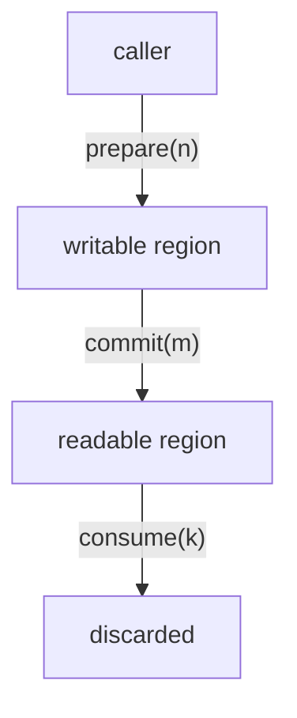

## Abstract

C++ has growable strings. C++ has growable vectors. C++ has no growable buffer for I/O.

A growable buffer for I/O has a different shape than `std::vector<std::byte>`. The caller reserves writable space, the buffer hands back a writable region, the caller writes (or fills it via a system call), the caller commits the bytes that were written. The same buffer holds readable bytes from prior commits; the caller consumes bytes from the front when they have been processed. Two phases for writes. Two phases for reads. The same object holds both. [Boost.Asio](https://www.boost.org/doc/libs/release/doc/html/boost_asio.html)<sup>[3]</sup> codified this shape over twenty years ago as the `DynamicBuffer` named requirement; the [Networking TS](http://www.open-std.org/jtc1/sc22/wg21/docs/papers/2018/n4771.pdf)<sup>[2]</sup> carried it into committee work; [.NET](https://learn.microsoft.com/en-us/dotnet/api/system.io.pipelines.pipewriter)<sup>[11]</sup> shipped `IBufferWriter<T>` in 2018; [Capy](https://github.com/cppalliance/capy)<sup>[1]</sup> ships four implementations today.

This paper documents the rationale for the shape, the required associated types, the four implementations that ship in Capy, and the deferrals.

This paper is the design-rationale companion to *Dynamic Buffer*<sup>[7]</sup>, which contains the proposal-only specification and the straw poll. It is part of the series defined by [P4100R1](https://www.open-std.org/jtc1/sc22/wg21/docs/papers/2026/p4100r1.pdf)<sup>[4]</sup>, in which Dynamic Buffer is Paper 5. The byte-region descriptors and sequence concepts that the dynamic buffer's associated types satisfy are documented in the companion paper *I/O Buffer Ranges: Design Rationale*<sup>[8]</sup> (Paper 4).

---

## Revision History

### R0: May 2026 (post-Brno mailing)

* Initial Version.

---

## 1. Disclosure

The author provides information and serves at the pleasure of the committee.

The author maintains [Boost.Beast](https://github.com/boostorg/beast)<sup>[5]</sup>, a published HTTP and WebSocket library built on Asio's dynamic-buffer model, and develops [Capy](https://github.com/cppalliance/capy)<sup>[1]</sup> and [Corosio](https://github.com/cppalliance/corosio)<sup>[6]</sup>, plus three further Boost libraries that consume dynamic buffers for protocol parsing. The body of work creates a bias toward dedicated dynamic-buffer concepts.

This paper documents the dynamic-buffer concept and its concrete implementations in Capy. The proposal-only ask paper is *Dynamic Buffer*<sup>[7]</sup>. The byte-region descriptors and sequence concepts the dynamic buffer's associated types satisfy are documented in *I/O Buffer Ranges: Design Rationale*<sup>[8]</sup>.

The [Networking TS](http://www.open-std.org/jtc1/sc22/wg21/docs/papers/2018/n4771.pdf)<sup>[2]</sup> defined `DynamicBuffer` as a named requirement. The shape in this paper is the same shape, recovered as a C++20 concept on a parallel track to the Network Endeavor.

A limitation of the proposed concept shape is honestly noted: the concept is not allocator-aware. Concrete implementations may be allocator-aware - `vector_dynamic_buffer` inherits the allocator of the wrapped `std::vector`<sup>[9]</sup> - but the concept does not require it. Section 8.1 records the deferral.

This paper is Paper 5 in the [Network Endeavor](https://www.open-std.org/jtc1/sc22/wg21/docs/papers/2026/p4100r1.pdf) ([P4100R1](https://www.open-std.org/jtc1/sc22/wg21/docs/papers/2026/p4100r1.pdf)<sup>[4]</sup>). It depends on Paper 4 (the buffer-ranges concepts) only - and that dependency is the type the concept's associated typedefs satisfy.

The companion papers are *Dynamic Buffer*<sup>[7]</sup> (proposal-only ask paper for the concept in this paper), *I/O Buffer Ranges*<sup>[10]</sup> and *I/O Buffer Ranges: Design Rationale*<sup>[8]</sup> (the companion pair covering the byte-region vocabulary), and [P4100R1](https://www.open-std.org/jtc1/sc22/wg21/docs/papers/2026/p4100r1.pdf)<sup>[4]</sup> (the umbrella paper that places this work in series).

Every implementation tour entry in this paper ships in Capy. Appendix B is the inventory.

The author asks for nothing.

---

## 2. The Two-Phase Model

A dynamic buffer holds bytes in three states: writable, readable, and discarded.



`prepare(n)` returns at least `n` bytes of writable space - a `mutable_buffer` (or sequence of `mutable_buffer`). The caller writes into that region. `commit(m)` makes the first `m` written bytes readable through `data()`. The caller observes the readable region by calling `data()`, which returns a `const_buffer` (or sequence) that references the readable bytes without moving them. Subsequent calls to `prepare` extend the writable region from after the committed bytes; subsequent calls to `data` return the accumulated readable bytes.

`consume(k)` discards the first `k` readable bytes. The discarded space may be reused for future `prepare` calls or may be released, at the implementation's discretion.

Two phases for writes. Two phases for reads. The same object holds both.

**The buffer owns the storage; the caller owns the work.**

---

## 3. The Concept

```cpp
template<class T>
concept DynamicBuffer =
    requires(T& t, T const& ct, std::size_t n) {
        typename T::const_buffers_type;
        typename T::mutable_buffers_type;
        { ct.size()     } -> std::convertible_to<std::size_t>;
        { ct.max_size() } -> std::convertible_to<std::size_t>;
        { ct.capacity() } -> std::convertible_to<std::size_t>;
        { ct.data()     } -> std::same_as<typename T::const_buffers_type>;
        { t.prepare(n)  } -> std::same_as<typename T::mutable_buffers_type>;
        t.commit(n);
        t.consume(n);
    } &&
    ConstBufferSequence<typename T::const_buffers_type> &&
    MutableBufferSequence<typename T::mutable_buffers_type>;
```

`prepare(n)` returns at least `n` bytes of writable space. `commit(n)` makes those bytes readable through `data()`. `data()` returns the readable portion. `consume(n)` discards `n` readable bytes from the front. `size()` is the readable byte count. `max_size()` is the largest the buffer can grow to. `capacity()` is the writable space available without reallocation.

`ConstBufferSequence` and `MutableBufferSequence` are defined in the companion paper *I/O Buffer Ranges: Design Rationale*<sup>[8]</sup>. The dynamic buffer's `const_buffers_type` and `mutable_buffers_type` must satisfy them.

---

## 4. Required Associated Types

`const_buffers_type` is what `data()` returns. `mutable_buffers_type` is what `prepare(n)` returns. They are member typedefs because the concrete sequence type depends on the buffer.

A flat buffer returns a single `const_buffer`. A circular buffer returns a `std::array<const_buffer, 2>` because the readable region may wrap around the storage. A linked-list buffer returns a range of regions. The associated types let the concept express this without naming a single sequence shape.

```cpp
class flat_dynamic_buffer
{
public:
    using const_buffers_type   = const_buffer;
    using mutable_buffers_type = mutable_buffer;
    // ...
};

class circular_dynamic_buffer
{
public:
    using const_buffers_type   = std::array<const_buffer, 2>;
    using mutable_buffers_type = std::array<mutable_buffer, 2>;
    // ...
};
```

The cost of the typedef pattern is one extra name per implementation. The benefit is that a generic algorithm can write `typename Buffer::const_buffers_type` and get the right shape - whether a single buffer, a fixed pair, or a range - without branching on the implementation.

**One concept. Three sequence shapes. The implementation chooses; the algorithm does not care.**

---

## 5. Concrete Implementations (Informative)

[Capy](https://github.com/cppalliance/capy)<sup>[1]</sup> ships four `DynamicBuffer` implementations. They are informative, not proposed - the standard library may ship its own concrete types or none at all. The implementations record what the four common shapes are and what each costs.

| Implementation              | Storage                                   | `const_buffers_type` | When to use                                |
| --------------------------- | ----------------------------------------- | -------------------- | ------------------------------------------ |
| `flat_dynamic_buffer`       | Caller-owned linear array                 | `const_buffer`       | Bounded, single contiguous region          |
| `circular_dynamic_buffer`   | Caller-owned ring buffer                  | `std::array<const_buffer, 2>` | Bounded, FIFO, no-copy reuse on consume |
| `vector_dynamic_buffer`     | Adapter over `std::vector<unsigned char>` | `const_buffer`       | Unbounded, allocator-aware via `std::vector` |
| `string_dynamic_buffer`     | Adapter over `std::basic_string`          | `const_buffer`       | Output buffer where consumer wants `string` |

The header set lives at `boost/capy/buffers/`<sup>[1]</sup>. Each header is under three hundred lines.

### 5.1 The Flat Case

`flat_dynamic_buffer` is a single contiguous region. `prepare(n)` extends the writable area within the storage; `commit` advances the readable boundary; `consume` advances the read cursor. When `consume` advances past half the storage, the implementation may compact the readable bytes to the start to free space at the back.

The caller-owned-storage choice is deliberate: the dynamic buffer is the bookkeeping, not the allocation. A user who wants stack storage uses a stack array; a user who wants heap storage uses a heap array; a user who wants pool-allocated storage uses a pool. The dynamic buffer does not care.

### 5.2 The Circular Case

`circular_dynamic_buffer` is a ring. The readable region may wrap from the end of the storage to the beginning. `data()` returns a `std::array<const_buffer, 2>` - two `const_buffer` slices that, concatenated, form the readable bytes. `prepare(n)` similarly returns a `std::array<mutable_buffer, 2>` that may straddle the wrap point.

The pair shape is the reason `mutable_buffers_type` and `const_buffers_type` are member typedefs. A flat buffer returns a single buffer; a ring returns a pair. Generic algorithms write to `typename T::mutable_buffers_type` and the right shape arrives.

### 5.3 The Adapter Cases

`vector_dynamic_buffer` and `string_dynamic_buffer` adapt existing standard containers. They do not own a separate storage; they adjust the container's size as `commit` and `consume` move the boundaries. The adapter pattern is what lets a user accumulate data into an `std::string` and then move the string out, or feed the dynamic buffer to a `std::vector`-based parser.

The adapter is also the reason the concept does not require ownership of the storage. The container outlives the adapter; the adapter is a thin window over the container's resizing.

**Four shapes. Same concept. The choice is the user's.**

---

## 6. Convergence

Three ecosystems standardize a growable buffer with a two-phase model. The shapes differ in detail but agree in essence.

| Ecosystem         | Type                                  | Two-phase write                       | Read                          |
| ----------------- | ------------------------------------- | ------------------------------------- | ----------------------------- |
| Asio (2003)       | `DynamicBuffer` named requirement<sup>[3]</sup> | `prepare(n)` then `commit(m)`         | `data()` then `consume(k)`    |
| Networking TS     | `DynamicBuffer` named requirement<sup>[2]</sup> | `prepare(n)` then `commit(m)`         | `data()` then `consume(k)`    |
| .NET (2018)       | `IBufferWriter<T>`<sup>[11]</sup>     | `GetMemory(n)` then `Advance(m)`      | (separate consumer side)      |
| Go (2012)         | `bytes.Buffer`<sup>[12]</sup>         | `Grow(n)` then `Write` (or direct write) | `Bytes()` then `Next(k)`     |

The Asio shape and the Networking TS shape are the same shape. .NET separates the producer interface (`IBufferWriter`) from the consumer interface (`PipeReader` and `ReadOnlySequence<T>`<sup>[13]</sup>); the two-phase write side matches `prepare`/`commit`. Go's `bytes.Buffer` provides `Grow`/`Write` and `Bytes`/`Next`; the names differ but the model is the same.

**Three ecosystems. One shape. C++ has the named requirement and the implementations; it does not have the concept in `std`.**

---

## 7. Anticipated Objections

### 7.1 "But `std::vector<std::byte>` Already Works"

`std::vector<std::byte>` provides one half of the model: appending bytes via `resize`, reading via `data()` and `size()`, discarding via `erase` from the front. The shape works for accumulators where every byte that goes in eventually comes out in order. It does not work for FIFO patterns where the writable and readable boundaries move independently - protocol parsers, streaming decoders, line-buffered I/O. `erase` from the front is `O(n)` in the bytes that follow; a circular buffer is `O(1)`. The dynamic buffer concept admits both shapes; `std::vector<std::byte>` admits only one.

The user who needs the vector shape and only the vector shape can use `std::vector<std::byte>` directly. The dynamic buffer concept exists for the user who needs the FIFO shape, the bounded-storage shape, the wrap-around shape, or any combination - and who wants generic algorithms to work over all of them.

### 7.2 "But `std::stringstream` Already Works"

`std::stringstream` provides a buffer with prepare/commit-like semantics through `std::stringbuf`'s `pbase`, `pptr`, `epptr`, `gbase`, `gptr`, and `egptr`. The shape predates the dynamic buffer concept. It is also not a buffer sequence: there is no scatter/gather, no integration with platform `readv`/`writev`, no way to use it with an I/O algorithm that expects a `MutableBufferSequence` for `read_some`.

The dynamic buffer concept's `mutable_buffers_type` and `const_buffers_type` integrate with the buffer-ranges vocabulary in *I/O Buffer Ranges: Design Rationale*<sup>[8]</sup>. `stringstream` does not.

### 7.3 "But the Networking TS Already Standardised This"

It did. The committee did not advance the Networking TS. The named requirement never reached the IS. This paper proposes the same shape as a C++20 concept, on a parallel track to the Network Endeavor. The buffer-ranges and dynamic-buffer concepts can ship without committing the standard library to anything else in the series.

### 7.4 "But This Belongs Inside a Future I/O Library"

The dynamic buffer concept has no async dependency. It is a synchronous bookkeeping abstraction over byte storage. A sender-based I/O library, a callback-based one, a coroutine-based one, or a synchronous loop can each consume a dynamic buffer through the same `prepare`/`commit`/`data`/`consume` interface. Coupling it to one async framework would force every other consumer to depend on that framework for a synchronous abstraction.

---

## 8. What This Paper Does Not Standardise

Four deferrals. Each is named so the scope is unambiguous.

### 8.1 Allocator-Aware `DynamicBuffer`

The proposed concept is allocation-agnostic. Concrete implementations may be allocator-aware - `vector_dynamic_buffer` inherits the allocator of the wrapped `std::vector`<sup>[9]</sup>, `string_dynamic_buffer` inherits the allocator of the wrapped `std::basic_string` - but the concept does not require it.

An allocator-aware variant of the concept would parameterize each `prepare` and `commit` on the allocator, or require a member typedef `allocator_type`, or both. The choice depends on whether allocator-awareness is part of the concept's contract or a refinement that some types satisfy and others do not. This paper takes the latter view: the concept is the smallest useful contract; allocator-awareness is a refinement.

### 8.2 Owned-Storage Variant

`flat_dynamic_buffer` and `circular_dynamic_buffer` are caller-owned-storage adapters. `vector_dynamic_buffer` and `string_dynamic_buffer` are container-owning. There is no concept-level distinction between the two - the concept does not record whether the buffer owns its storage or borrows it.

A future paper may propose a refined concept (or a tag type) that distinguishes ownership. The current paper does not, because every consumer surveyed treats both shapes uniformly through the same interface.

### 8.3 Lifetime Parameterisation

The concept does not constrain how the dynamic buffer is passed across function boundaries (by value, by reference, by forwarding reference). The choice depends on whether the buffer's bookkeeping is in the wrapped object (adapter case) or in the dynamic buffer itself (caller-owned-storage case). [Capy](https://github.com/cppalliance/capy)<sup>[1]</sup> uses a separate concept `DynamicBufferParam` to disambiguate the two cases at coroutine boundaries; this paper does not propose that refinement.

### 8.4 Concrete Standard Implementations

This paper proposes the concept. It does not propose `std::io::flat_dynamic_buffer`, `std::io::circular_dynamic_buffer`, or any other concrete type. The four implementations in [Capy](https://github.com/cppalliance/capy)<sup>[1]</sup> are informative; the standard library may ship them, ship others, or ship none. The concept stands on its own.

---

## 9. Why Now

Asio shipped the `DynamicBuffer` named requirement in 2003. The Networking TS carried it forward. .NET shipped `IBufferWriter<T>` in 2018. Capy ships four implementations today. The shape is twenty-three years old in production deployment. The C++ standard library does not have it.

The reason for now is the same reason the buffer-ranges paper is for now: the Network Endeavor frames this work as a fourteen-paper series ([P4100R1](https://www.open-std.org/jtc1/sc22/wg21/docs/papers/2026/p4100r1.pdf)<sup>[4]</sup>), and the buffer concepts are the foundation that the stream concepts build on. Without the dynamic buffer concept, the stream concepts cannot express the read-into-growable-buffer pattern that protocol parsers, HTTP message readers, and TLS record buffers all use.

**The vocabulary every C++ I/O system already speaks. The standard library is the place that does not have it.**

---

## 10. Closing

```cpp
namespace std::io {

  template<class T> concept DynamicBuffer = /* see Section 3 */;

}
```

We built four implementations. They work. We are reporting what we found. Proposed wording for the concept lives in *Dynamic Buffer*<sup>[7]</sup>.

---

## Appendix A. `<std::io>` Synopsis (Informative)

Dynamic-buffer-only synopsis. The byte-region descriptors and sequence concepts that the associated types satisfy live in *I/O Buffer Ranges: Design Rationale*<sup>[8]</sup>.

```cpp
namespace std::io {

  // The DynamicBuffer concept
  template<class T>
  concept DynamicBuffer =
      requires(T& t, T const& ct, std::size_t n) {
          typename T::const_buffers_type;
          typename T::mutable_buffers_type;
          { ct.size()     } -> std::convertible_to<std::size_t>;
          { ct.max_size() } -> std::convertible_to<std::size_t>;
          { ct.capacity() } -> std::convertible_to<std::size_t>;
          { ct.data()     } -> std::same_as<typename T::const_buffers_type>;
          { t.prepare(n)  } -> std::same_as<typename T::mutable_buffers_type>;
          t.commit(n);
          t.consume(n);
      } &&
      ConstBufferSequence<typename T::const_buffers_type> &&
      MutableBufferSequence<typename T::mutable_buffers_type>;

}
```

---

## Appendix B. Capy Header Inventory

The dynamic-buffer concept and its concrete implementations ship in the following [Capy](https://github.com/cppalliance/capy)<sup>[1]</sup> headers. The byte-region vocabulary headers are listed in *I/O Buffer Ranges: Design Rationale*<sup>[8]</sup> Appendix B.

| Header                                            | Provides                                                                                  |
| ------------------------------------------------- | ----------------------------------------------------------------------------------------- |
| `boost/capy/concept/dynamic_buffer.hpp`           | `DynamicBuffer` concept                                                                   |
| `boost/capy/buffers/flat_dynamic_buffer.hpp`      | `flat_dynamic_buffer` (informative)                                                       |
| `boost/capy/buffers/circular_dynamic_buffer.hpp`  | `circular_dynamic_buffer` (informative)                                                   |
| `boost/capy/buffers/vector_dynamic_buffer.hpp`    | `vector_dynamic_buffer` (informative)                                                     |
| `boost/capy/buffers/string_dynamic_buffer.hpp`    | `basic_string_dynamic_buffer`, `string_dynamic_buffer` (informative)                      |

---

## Acknowledgments

Christopher Kohlhoff designed the Asio `DynamicBuffer` named requirement and the four-operation interface (`prepare`, `commit`, `data`, `consume`) that this paper recovers as a C++20 concept. Twenty-three years of production deployment in Asio<sup>[3]</sup> is the foundation this work builds on.

The Networking TS authors codified the operational semantics of the dynamic buffer in [N4771](http://www.open-std.org/jtc1/sc22/wg21/docs/papers/2018/n4771.pdf)<sup>[2]</sup>. The shape in this paper is the shape they specified.

The .NET runtime team shipped `IBufferWriter<T>`<sup>[11]</sup> and `ReadOnlySequence<T>`<sup>[13]</sup> in 2018. The producer/consumer split in `System.IO.Pipelines` informed the model in this paper, particularly the recognition that a single concept can describe both the writable-side and readable-side phases.

Peter Dimov's review of the Capy buffer code surfaced the contract questions tracked in capy issues 261 (slice manipulation), 262 (customization points), and 263 (sequence ownership). Those discussions remain open and do not affect the dynamic-buffer concept proposed here, but they shape how the buffer-sequence vocabulary the dynamic buffer rests on may evolve.

---

## References

[1] [Capy](https://github.com/cppalliance/capy) - Coroutine-native I/O abstractions for C++20 (Vinnie Falco, 2023-2026).

[2] [N4771](http://www.open-std.org/jtc1/sc22/wg21/docs/papers/2018/n4771.pdf) - "Working Draft, C++ Extensions for Networking" (Jonathan Wakely, 2018).

[3] [Boost.Asio](https://www.boost.org/doc/libs/release/doc/html/boost_asio.html) - `DynamicBuffer` named requirement (Christopher Kohlhoff, 2003-2026).

[4] [P4100R1](https://www.open-std.org/jtc1/sc22/wg21/docs/papers/2026/p4100r1.pdf) - "Coroutine-Native I/O for C++29 (The Network Endeavor)" (Vinnie Falco, Steve Gerbino, Michael Vandeberg, Mungo Gill, Mohammad Nejati, 2026).

[5] [Boost.Beast](https://github.com/boostorg/beast) - HTTP and WebSocket built on Boost.Asio (Vinnie Falco, 2017-2026).

[6] [Corosio](https://github.com/cppalliance/corosio) - Coroutine-native I/O on epoll, kqueue, and IOCP (Vinnie Falco, 2024-2026).

[7] *Dynamic Buffer* (Vinnie Falco, 2026). Companion ask paper. D0009R0.

[8] *I/O Buffer Ranges: Design Rationale* (Vinnie Falco, 2026). Companion design paper for the byte-region descriptors and sequence concepts. D0008R0.

[9] [C++ Working Draft](https://eel.is/c++draft/) - `<vector>`, `<string>`.

[10] *I/O Buffer Ranges* (Vinnie Falco, 2026). Companion ask paper for the byte-region vocabulary. D0007R0.

[11] [.NET API: System.Buffers.IBufferWriter&lt;T&gt;](https://learn.microsoft.com/en-us/dotnet/api/system.buffers.ibufferwriter-1) - Producer interface for incremental writes (Microsoft, 2018-2026).

[12] [Go standard library: `bytes.Buffer`](https://pkg.go.dev/bytes#Buffer) - Variable-sized buffer of bytes with Read and Write methods (The Go Authors, 2012-2026).

[13] [.NET API: System.Buffers.ReadOnlySequence&lt;T&gt;](https://learn.microsoft.com/en-us/dotnet/api/system.buffers.readonlysequence-1) - Consumer-side linked sequence of `Memory<T>` segments (Microsoft, 2018-2026).
